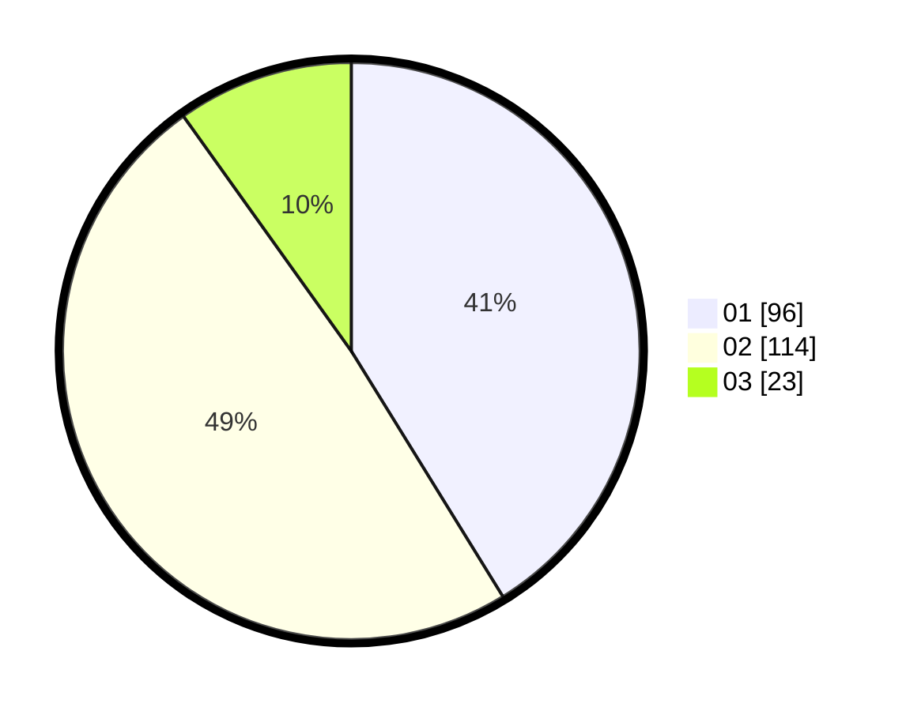

# Hasil

Hasil perolehan suara paslon dapat dilihat pada file paslon-01.txt, paslon-02.txt, dan paslon-03.txt.

Jika tidak ada, artinya data tersebut belum ada pada SIREKAP.

## Perolehan Suara

 * Paslon 01: **96**.
 * Paslon 02: **114**.
 * Paslon 03: **23**.

## Foto C Plano

https://sirekap-obj-formc.kpu.go.id/5170/pemilu/ppwp/31/74/09/10/01/3174091001024-20240215-083408--80318d32-3b47-44bd-8a1c-d27d7a760ffc.jpg

https://sirekap-obj-formc.kpu.go.id/5170/pemilu/ppwp/31/74/09/10/01/3174091001024-20240215-083418--36e9ff1b-8d91-45f6-8c1a-0f76b4597a80.jpg

https://sirekap-obj-formc.kpu.go.id/5170/pemilu/ppwp/31/74/09/10/01/3174091001024-20240215-083439--97022dfa-a159-4e5c-96d9-62698ebd2fb5.jpg

## DATA PEMILIH TETAP

Jumlah pemilih dalam DPT: **265**.
 * L: **130**.
 * P: **135**.

## DATA PENGGUNA HAK PILIH

Jumlah pengguna hak pilih dalam DPT: **216**.
 * L: **100**.
 * P: **116**.

Jumlah pengguna hak pilih dalam DPTb: **13**.
 * L: **8**.
 * P: **5**.

Jumlah pengguna hak pilih dalam DPK: **7**.
 * L: **4**.
 * P: **3**.

Jumlah pengguna hak pilih: **236**.
 * L: **112**.
 * P: **124**.

## JUMLAH SUARA SAH DAN TIDAK SAH

JUMLAH SELURUH SUARA SAH: **233**.

JUMLAH SUARA TIDAK SAH: **3**.

JUMLAH SELURUH SUARA SAH DAN SUARA TIDAK SAH: **236**.
