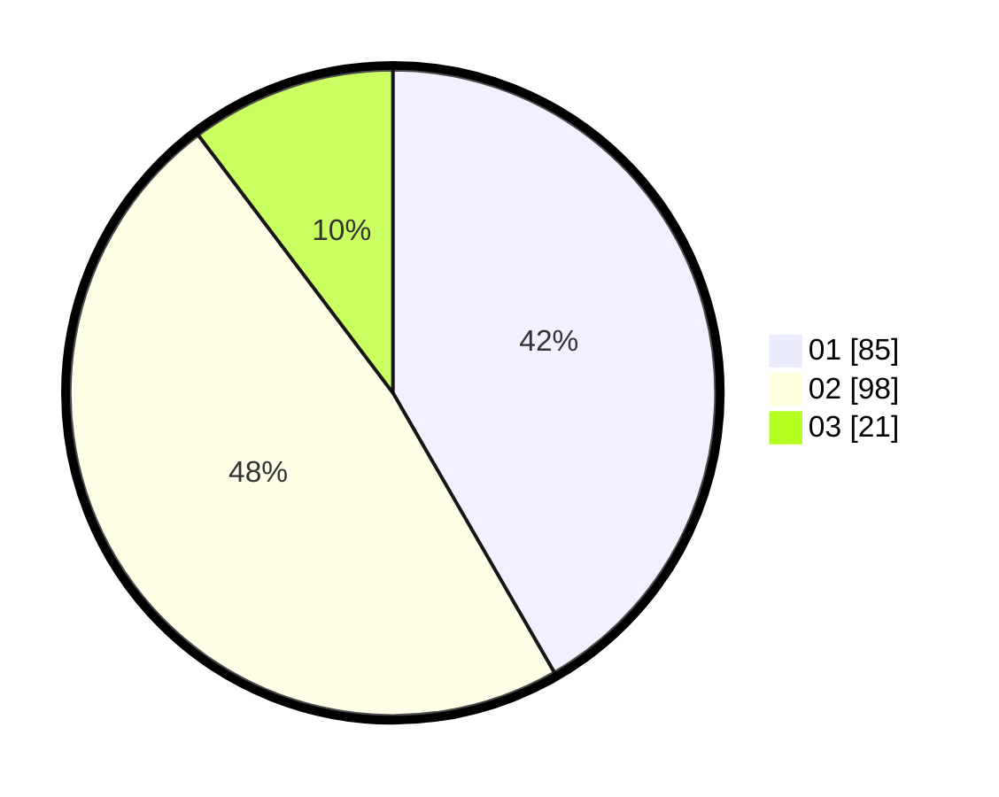

# Hasil

Hasil perolehan suara paslon dapat dilihat pada file paslon-01.txt, paslon-02.txt, dan paslon-03.txt.

Jika tidak ada, artinya data tersebut belum ada pada SIREKAP.

## Perolehan Suara

 * Paslon 01: **85**.
 * Paslon 02: **98**.
 * Paslon 03: **21**.

## Foto C Plano

https://sirekap-obj-formc.kpu.go.id/5593/pemilu/ppwp/31/74/09/10/01/3174091001026-20240216-010028--f7b8995b-06ab-4066-87db-7aa3601da36a.jpg

https://sirekap-obj-formc.kpu.go.id/5593/pemilu/ppwp/31/74/09/10/01/3174091001026-20240216-010030--9361c8fe-cafb-4abb-9b25-eff5609fe3c7.jpg

https://sirekap-obj-formc.kpu.go.id/5593/pemilu/ppwp/31/74/09/10/01/3174091001026-20240216-010029--6270ea19-8092-47dd-a041-e2d851c10fe1.jpg

## DATA PEMILIH TETAP

Jumlah pemilih dalam DPT: **259**.
 * L: **123**.
 * P: **136**.

## DATA PENGGUNA HAK PILIH

Jumlah pengguna hak pilih dalam DPT: **204**.
 * L: **92**.
 * P: **112**.

Jumlah pengguna hak pilih dalam DPTb: **2**.
 * L: **1**.
 * P: **1**.

Jumlah pengguna hak pilih dalam DPK: **1**.
 * L: **0**.
 * P: **1**.

Jumlah pengguna hak pilih: **207**.
 * L: **93**.
 * P: **114**.

## JUMLAH SUARA SAH DAN TIDAK SAH

JUMLAH SELURUH SUARA SAH: **204**.

JUMLAH SUARA TIDAK SAH: **3**.

JUMLAH SELURUH SUARA SAH DAN SUARA TIDAK SAH: **207**.
