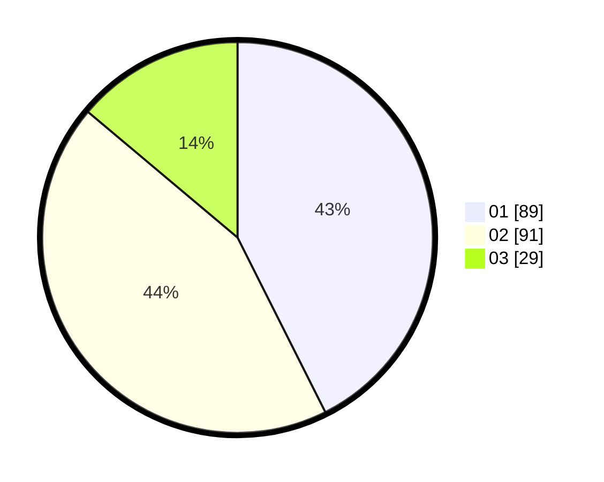

# Hasil

Hasil perolehan suara paslon dapat dilihat pada file paslon-01.txt, paslon-02.txt, dan paslon-03.txt.

Jika tidak ada, artinya data tersebut belum ada pada SIREKAP.

## Perolehan Suara

 * Paslon 01: **89**.
 * Paslon 02: **91**.
 * Paslon 03: **29**.

## Foto C Plano

https://sirekap-obj-formc.kpu.go.id/3a56/pemilu/ppwp/31/74/09/10/01/3174091001034-20240215-222745--e61a782c-44ce-42e8-a941-b3b9a13e5adf.jpg

https://sirekap-obj-formc.kpu.go.id/3a56/pemilu/ppwp/31/74/09/10/01/3174091001034-20240215-222747--a5cc0504-ce47-4c37-9f75-842f317c27a3.jpg

https://sirekap-obj-formc.kpu.go.id/3a56/pemilu/ppwp/31/74/09/10/01/3174091001034-20240215-222746--c3d12f37-14d7-4853-bb9b-1574080c3592.jpg

## DATA PEMILIH TETAP

Jumlah pemilih dalam DPT: **255**.
 * L: **131**.
 * P: **124**.

## DATA PENGGUNA HAK PILIH

Jumlah pengguna hak pilih dalam DPT: **201**.
 * L: **99**.
 * P: **102**.

Jumlah pengguna hak pilih dalam DPTb: **14**.
 * L: **9**.
 * P: **5**.

Jumlah pengguna hak pilih dalam DPK: **1**.
 * L: **0**.
 * P: **1**.

Jumlah pengguna hak pilih: **216**.
 * L: **108**.
 * P: **108**.

## JUMLAH SUARA SAH DAN TIDAK SAH

JUMLAH SELURUH SUARA SAH: **209**.

JUMLAH SUARA TIDAK SAH: **7**.

JUMLAH SELURUH SUARA SAH DAN SUARA TIDAK SAH: **216**.
