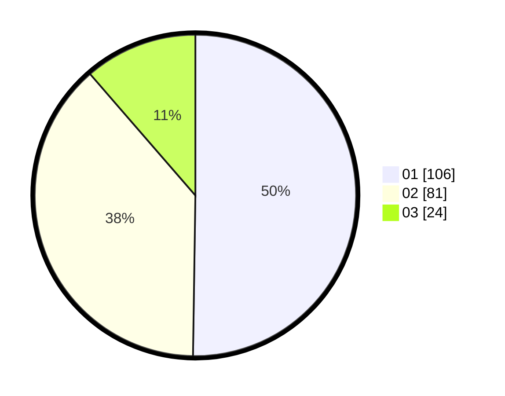

# Hasil

Hasil perolehan suara paslon dapat dilihat pada file paslon-01.txt, paslon-02.txt, dan paslon-03.txt.

Jika tidak ada, artinya data tersebut belum ada pada SIREKAP.

## Perolehan Suara

 * Paslon 01: **106**.
 * Paslon 02: **81**.
 * Paslon 03: **24**.

## Foto C Plano

https://sirekap-obj-formc.kpu.go.id/9c00/pemilu/ppwp/31/74/09/10/01/3174091001035-20240216-042620--64fcd7f2-0075-4f77-a295-e345cdbb6afb.jpg

https://sirekap-obj-formc.kpu.go.id/9c00/pemilu/ppwp/31/74/09/10/01/3174091001035-20240214-203418--70de8cf2-265c-4bfc-9017-db8ae12cad01.jpg

https://sirekap-obj-formc.kpu.go.id/9c00/pemilu/ppwp/31/74/09/10/01/3174091001035-20240214-155355--2e0550b7-1a10-45cf-ada1-ed60c1990139.jpg

## DATA PEMILIH TETAP

Jumlah pemilih dalam DPT: **251**.
 * L: **126**.
 * P: **125**.

## DATA PENGGUNA HAK PILIH

Jumlah pengguna hak pilih dalam DPT: **194**.
 * L: **86**.
 * P: **108**.

Jumlah pengguna hak pilih dalam DPTb: **10**.
 * L: **6**.
 * P: **4**.

Jumlah pengguna hak pilih dalam DPK: **7**.
 * L: **2**.
 * P: **5**.

Jumlah pengguna hak pilih: **211**.
 * L: **94**.
 * P: **117**.

## JUMLAH SUARA SAH DAN TIDAK SAH

JUMLAH SELURUH SUARA SAH: **211**.

JUMLAH SUARA TIDAK SAH: **0**.

JUMLAH SELURUH SUARA SAH DAN SUARA TIDAK SAH: **211**.
