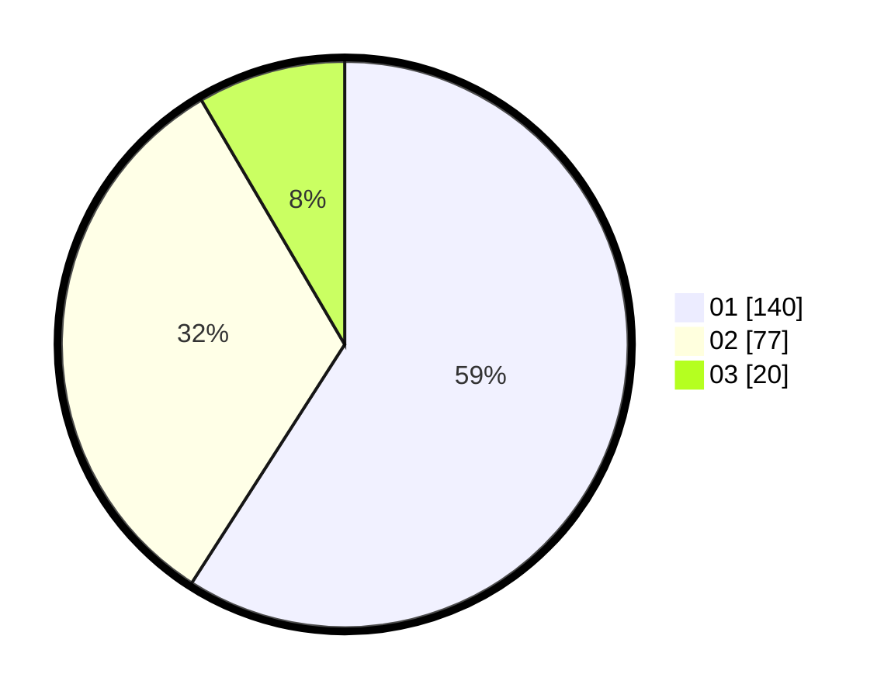

# Hasil

Hasil perolehan suara paslon dapat dilihat pada file paslon-01.txt, paslon-02.txt, dan paslon-03.txt.

Jika tidak ada, artinya data tersebut belum ada pada SIREKAP.

## Perolehan Suara

 * Paslon 01: **140**.
 * Paslon 02: **77**.
 * Paslon 03: **20**.

## Foto C Plano

https://sirekap-obj-formc.kpu.go.id/52ac/pemilu/ppwp/31/74/09/10/01/3174091001045-20240215-013234--b61b0f22-dcd9-4b23-934c-08b00f05922f.jpg

https://sirekap-obj-formc.kpu.go.id/52ac/pemilu/ppwp/31/74/09/10/01/3174091001045-20240215-013426--496219cf-6231-48ae-83c0-1f87175d115d.jpg

https://sirekap-obj-formc.kpu.go.id/52ac/pemilu/ppwp/31/74/09/10/01/3174091001045-20240215-013509--6cc3c4db-8897-4673-9c59-61a54344a569.jpg

## DATA PEMILIH TETAP

Jumlah pemilih dalam DPT: **283**.
 * L: **135**.
 * P: **148**.

## DATA PENGGUNA HAK PILIH

Jumlah pengguna hak pilih dalam DPT: **235**.
 * L: **113**.
 * P: **122**.

Jumlah pengguna hak pilih dalam DPTb: **0**.
 * L: **0**.
 * P: **0**.

Jumlah pengguna hak pilih dalam DPK: **4**.
 * L: **2**.
 * P: **2**.

Jumlah pengguna hak pilih: **239**.
 * L: **115**.
 * P: **124**.

## JUMLAH SUARA SAH DAN TIDAK SAH

JUMLAH SELURUH SUARA SAH: **237**.

JUMLAH SUARA TIDAK SAH: **2**.

JUMLAH SELURUH SUARA SAH DAN SUARA TIDAK SAH: **239**.
