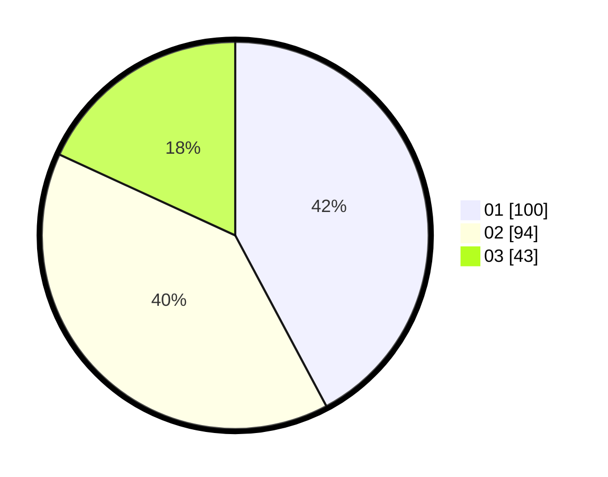

# Hasil

Hasil perolehan suara paslon dapat dilihat pada file paslon-01.txt, paslon-02.txt, dan paslon-03.txt.

Jika tidak ada, artinya data tersebut belum ada pada SIREKAP.

## Perolehan Suara

 * Paslon 01: **100**.
 * Paslon 02: **94**.
 * Paslon 03: **43**.

## Foto C Plano

https://sirekap-obj-formc.kpu.go.id/b86e/pemilu/ppwp/31/74/09/10/01/3174091001068-20240214-190633--0e712870-a778-4467-99d9-7019c7f7cdbd.jpg

https://sirekap-obj-formc.kpu.go.id/b86e/pemilu/ppwp/31/74/09/10/01/3174091001068-20240214-190639--e31ae408-9e73-4505-9170-eac8717892ec.jpg

https://sirekap-obj-formc.kpu.go.id/b86e/pemilu/ppwp/31/74/09/10/01/3174091001068-20240214-190647--f56d0764-4488-45b0-aa31-29ce700f64c0.jpg

## DATA PEMILIH TETAP

Jumlah pemilih dalam DPT: **266**.
 * L: **136**.
 * P: **130**.

## DATA PENGGUNA HAK PILIH

Jumlah pengguna hak pilih dalam DPT: **234**.
 * L: **115**.
 * P: **119**.

Jumlah pengguna hak pilih dalam DPTb: **1**.
 * L: **0**.
 * P: **1**.

Jumlah pengguna hak pilih dalam DPK: **5**.
 * L: **3**.
 * P: **2**.

Jumlah pengguna hak pilih: **240**.
 * L: **118**.
 * P: **122**.

## JUMLAH SUARA SAH DAN TIDAK SAH

JUMLAH SELURUH SUARA SAH: **237**.

JUMLAH SUARA TIDAK SAH: **3**.

JUMLAH SELURUH SUARA SAH DAN SUARA TIDAK SAH: **240**.
