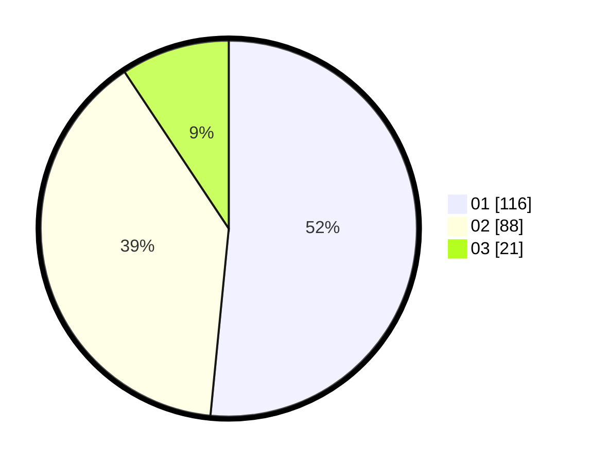

# Hasil

Hasil perolehan suara paslon dapat dilihat pada file paslon-01.txt, paslon-02.txt, dan paslon-03.txt.

Jika tidak ada, artinya data tersebut belum ada pada SIREKAP.

## Perolehan Suara

 * Paslon 01: **116**.
 * Paslon 02: **88**.
 * Paslon 03: **21**.

## Foto C Plano

https://sirekap-obj-formc.kpu.go.id/c214/pemilu/ppwp/31/74/09/10/01/3174091001070-20240215-210450--c01999a1-b4d9-405f-a981-0bb7c2a9ec11.jpg

https://sirekap-obj-formc.kpu.go.id/c214/pemilu/ppwp/31/74/09/10/01/3174091001070-20240214-155833--116c154a-8734-45e3-9bb8-dbdc873b66e4.jpg

https://sirekap-obj-formc.kpu.go.id/c214/pemilu/ppwp/31/74/09/10/01/3174091001070-20240214-203538--318dcefb-8485-414f-9fbd-3411887746cc.jpg

## DATA PEMILIH TETAP

Jumlah pemilih dalam DPT: **261**.
 * L: **132**.
 * P: **129**.

## DATA PENGGUNA HAK PILIH

Jumlah pengguna hak pilih dalam DPT: **214**.
 * L: **108**.
 * P: **106**.

Jumlah pengguna hak pilih dalam DPTb: **13**.
 * L: **10**.
 * P: **3**.

Jumlah pengguna hak pilih dalam DPK: **1**.
 * L: **0**.
 * P: **1**.

Jumlah pengguna hak pilih: **228**.
 * L: **118**.
 * P: **110**.

## JUMLAH SUARA SAH DAN TIDAK SAH

JUMLAH SELURUH SUARA SAH: **225**.

JUMLAH SUARA TIDAK SAH: **3**.

JUMLAH SELURUH SUARA SAH DAN SUARA TIDAK SAH: **228**.
