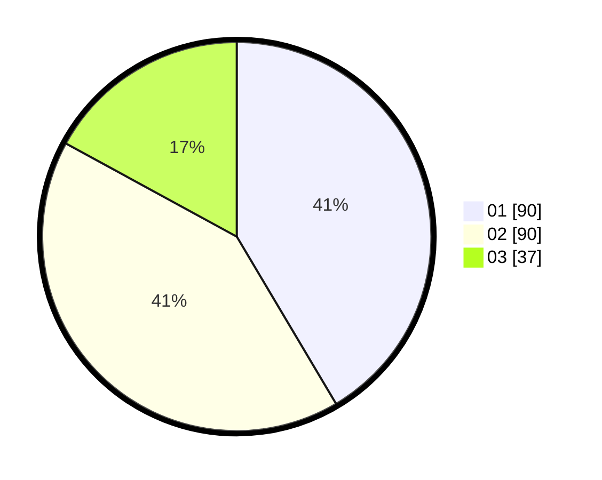

# Hasil

Hasil perolehan suara paslon dapat dilihat pada file paslon-01.txt, paslon-02.txt, dan paslon-03.txt.

Jika tidak ada, artinya data tersebut belum ada pada SIREKAP.

## Perolehan Suara

 * Paslon 01: **90**.
 * Paslon 02: **90**.
 * Paslon 03: **37**.

## Foto C Plano

https://sirekap-obj-formc.kpu.go.id/6043/pemilu/ppwp/31/74/09/10/01/3174091001071-20240214-215404--8f994c71-fb6a-4872-a6e5-08144cc78335.jpg

https://sirekap-obj-formc.kpu.go.id/6043/pemilu/ppwp/31/74/09/10/01/3174091001071-20240214-215542--73160623-de85-4998-a7ca-1281040f4e79.jpg

https://sirekap-obj-formc.kpu.go.id/6043/pemilu/ppwp/31/74/09/10/01/3174091001071-20240216-154855--ae1aff84-75eb-41a9-b774-250e4d7b232c.jpg

## DATA PEMILIH TETAP

Jumlah pemilih dalam DPT: **261**.
 * L: **127**.
 * P: **134**.

## DATA PENGGUNA HAK PILIH

Jumlah pengguna hak pilih dalam DPT: **211**.
 * L: **100**.
 * P: **111**.

Jumlah pengguna hak pilih dalam DPTb: **7**.
 * L: **2**.
 * P: **5**.

Jumlah pengguna hak pilih dalam DPK: **0**.
 * L: **0**.
 * P: **0**.

Jumlah pengguna hak pilih: **218**.
 * L: **102**.
 * P: **116**.

## JUMLAH SUARA SAH DAN TIDAK SAH

JUMLAH SELURUH SUARA SAH: **217**.

JUMLAH SUARA TIDAK SAH: **1**.

JUMLAH SELURUH SUARA SAH DAN SUARA TIDAK SAH: **218**.
