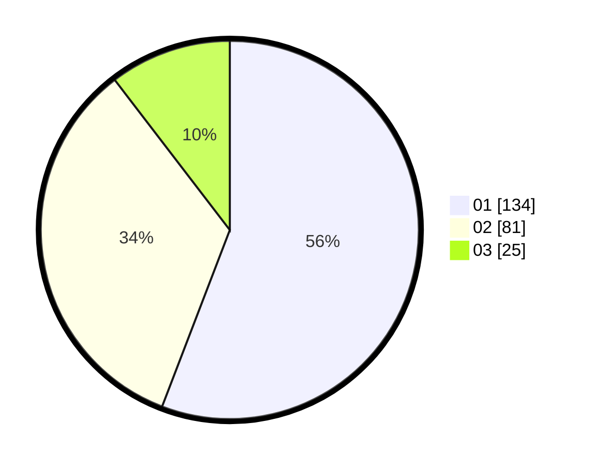

# Hasil

Hasil perolehan suara paslon dapat dilihat pada file paslon-01.txt, paslon-02.txt, dan paslon-03.txt.

Jika tidak ada, artinya data tersebut belum ada pada SIREKAP.

## Perolehan Suara

 * Paslon 01: **134**.
 * Paslon 02: **81**.
 * Paslon 03: **25**.

## Foto C Plano

https://sirekap-obj-formc.kpu.go.id/161f/pemilu/ppwp/31/74/09/10/01/3174091001077-20240216-101131--58c37028-9a8e-4859-be72-42c4ba0c0ac3.jpg

https://sirekap-obj-formc.kpu.go.id/161f/pemilu/ppwp/31/74/09/10/01/3174091001077-20240216-100459--f253ef90-0c59-4569-97a4-cd35063667c3.jpg

https://sirekap-obj-formc.kpu.go.id/161f/pemilu/ppwp/31/74/09/10/01/3174091001077-20240216-101122--e6419fb9-1379-4c04-bd93-0cfa2da5d604.jpg

## DATA PEMILIH TETAP

Jumlah pemilih dalam DPT: **292**.
 * L: **145**.
 * P: **147**.

## DATA PENGGUNA HAK PILIH

Jumlah pengguna hak pilih dalam DPT: **240**.
 * L: **115**.
 * P: **125**.

Jumlah pengguna hak pilih dalam DPTb: **2**.
 * L: **1**.
 * P: **1**.

Jumlah pengguna hak pilih dalam DPK: **1**.
 * L: **1**.
 * P: **0**.

Jumlah pengguna hak pilih: **243**.
 * L: **117**.
 * P: **126**.

## JUMLAH SUARA SAH DAN TIDAK SAH

JUMLAH SELURUH SUARA SAH: **240**.

JUMLAH SUARA TIDAK SAH: **3**.

JUMLAH SELURUH SUARA SAH DAN SUARA TIDAK SAH: **243**.
