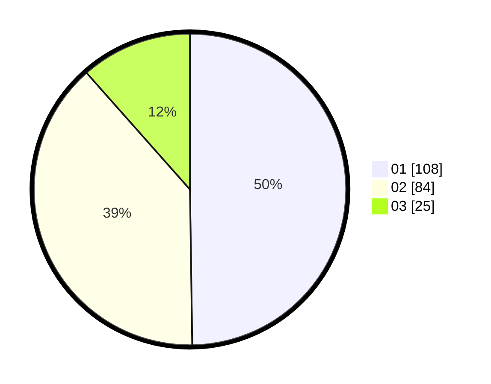

# Hasil

Hasil perolehan suara paslon dapat dilihat pada file paslon-01.txt, paslon-02.txt, dan paslon-03.txt.

Jika tidak ada, artinya data tersebut belum ada pada SIREKAP.

## Perolehan Suara

 * Paslon 01: **108**.
 * Paslon 02: **84**.
 * Paslon 03: **25**.

## Foto C Plano

https://sirekap-obj-formc.kpu.go.id/b96b/pemilu/ppwp/31/74/09/10/01/3174091001082-20240214-193744--2e75fb7b-a37c-4801-b508-17cca79250af.jpg

https://sirekap-obj-formc.kpu.go.id/b96b/pemilu/ppwp/31/74/09/10/01/3174091001082-20240216-104051--c69ba20a-d4d0-49ec-92b3-a64e4b31f0e9.jpg

https://sirekap-obj-formc.kpu.go.id/b96b/pemilu/ppwp/31/74/09/10/01/3174091001082-20240214-193938--a01b41ca-df10-47f5-9d81-8d4b4557778e.jpg
