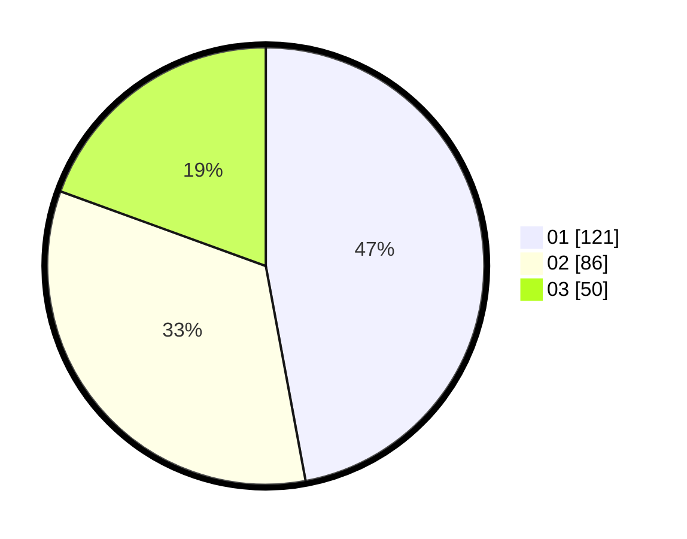

# Hasil

Hasil perolehan suara paslon dapat dilihat pada file paslon-01.txt, paslon-02.txt, dan paslon-03.txt.

Jika tidak ada, artinya data tersebut belum ada pada SIREKAP.

## Perolehan Suara

 * Paslon 01: **121**.
 * Paslon 02: **86**.
 * Paslon 03: **50**.

## Foto C Plano

https://sirekap-obj-formc.kpu.go.id/83e1/pemilu/ppwp/31/74/09/10/01/3174091001085-20240214-214309--413575d3-1264-495f-be44-44a4d7de108f.jpg

https://sirekap-obj-formc.kpu.go.id/83e1/pemilu/ppwp/31/74/09/10/01/3174091001085-20240214-214319--92c0fbb5-10bd-4c16-89ff-7cb66181f1e4.jpg

https://sirekap-obj-formc.kpu.go.id/83e1/pemilu/ppwp/31/74/09/10/01/3174091001085-20240214-214322--eead1d82-375c-40f6-ad40-6f3f8628fe3e.jpg
