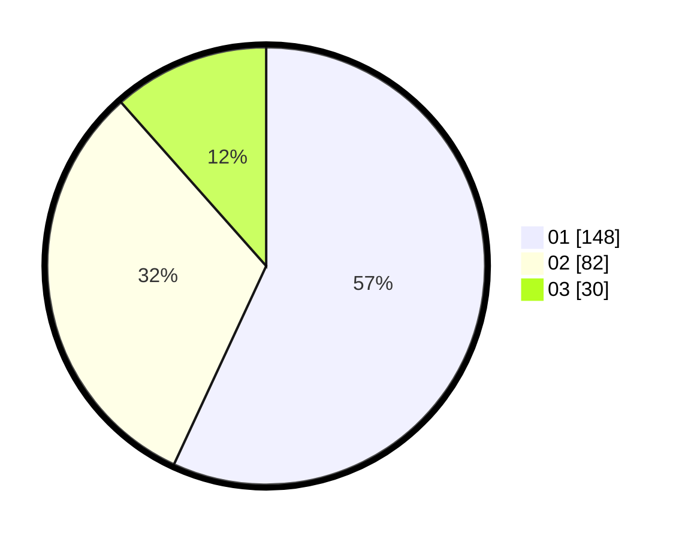

# Hasil

Hasil perolehan suara paslon dapat dilihat pada file paslon-01.txt, paslon-02.txt, dan paslon-03.txt.

Jika tidak ada, artinya data tersebut belum ada pada SIREKAP.

## Perolehan Suara

 * Paslon 01: **148**.
 * Paslon 02: **82**.
 * Paslon 03: **30**.

## Foto C Plano

https://sirekap-obj-formc.kpu.go.id/ec04/pemilu/ppwp/31/74/09/10/01/3174091001086-20240214-155151--f86993e8-3ee9-4876-8378-602281276d3d.jpg

https://sirekap-obj-formc.kpu.go.id/ec04/pemilu/ppwp/31/74/09/10/01/3174091001086-20240214-155250--8ac0d220-32e3-4925-a179-8565d8f6c5fe.jpg

https://sirekap-obj-formc.kpu.go.id/ec04/pemilu/ppwp/31/74/09/10/01/3174091001086-20240214-155417--dbb51ea3-67ca-4e87-8c51-e559ec5f979a.jpg

## DATA PEMILIH TETAP

Jumlah pemilih dalam DPT: **296**.
 * L: **148**.
 * P: **148**.

## DATA PENGGUNA HAK PILIH

Jumlah pengguna hak pilih dalam DPT: **257**.
 * L: **127**.
 * P: **130**.

Jumlah pengguna hak pilih dalam DPTb: **1**.
 * L: **0**.
 * P: **1**.

Jumlah pengguna hak pilih dalam DPK: **3**.
 * L: **2**.
 * P: **1**.

Jumlah pengguna hak pilih: **261**.
 * L: **129**.
 * P: **132**.

## JUMLAH SUARA SAH DAN TIDAK SAH

JUMLAH SELURUH SUARA SAH: **260**.

JUMLAH SUARA TIDAK SAH: **1**.

JUMLAH SELURUH SUARA SAH DAN SUARA TIDAK SAH: **261**.
