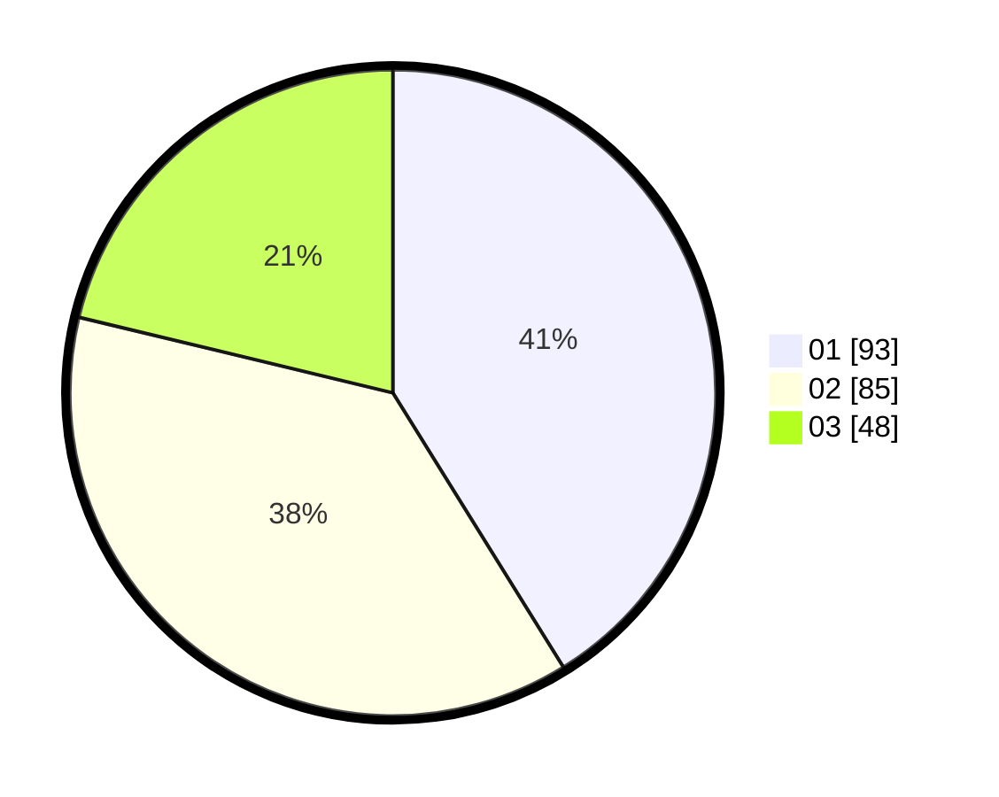

# Hasil

Hasil perolehan suara paslon dapat dilihat pada file paslon-01.txt, paslon-02.txt, dan paslon-03.txt.

Jika tidak ada, artinya data tersebut belum ada pada SIREKAP.

## Perolehan Suara

 * Paslon 01: **93**.
 * Paslon 02: **85**.
 * Paslon 03: **48**.

## Foto C Plano

https://sirekap-obj-formc.kpu.go.id/5f9e/pemilu/ppwp/31/74/09/10/01/3174091001087-20240214-195341--a16329b3-6e01-45f6-84a9-86f2b96a2128.jpg

https://sirekap-obj-formc.kpu.go.id/5f9e/pemilu/ppwp/31/74/09/10/01/3174091001087-20240214-235707--962f30be-813f-4513-b851-b54454a5680d.jpg

https://sirekap-obj-formc.kpu.go.id/5f9e/pemilu/ppwp/31/74/09/10/01/3174091001087-20240214-195617--7b469dd6-3943-4f18-a9bd-68ec96611d19.jpg

## DATA PEMILIH TETAP

Jumlah pemilih dalam DPT: **267**.
 * L: **138**.
 * P: **129**.

## DATA PENGGUNA HAK PILIH

Jumlah pengguna hak pilih dalam DPT: **224**.
 * L: **112**.
 * P: **112**.

Jumlah pengguna hak pilih dalam DPTb: **1**.
 * L: **0**.
 * P: **1**.

Jumlah pengguna hak pilih dalam DPK: **3**.
 * L: **1**.
 * P: **2**.

Jumlah pengguna hak pilih: **228**.
 * L: **113**.
 * P: **115**.

## JUMLAH SUARA SAH DAN TIDAK SAH

JUMLAH SELURUH SUARA SAH: **226**.

JUMLAH SUARA TIDAK SAH: **2**.

JUMLAH SELURUH SUARA SAH DAN SUARA TIDAK SAH: **228**.
