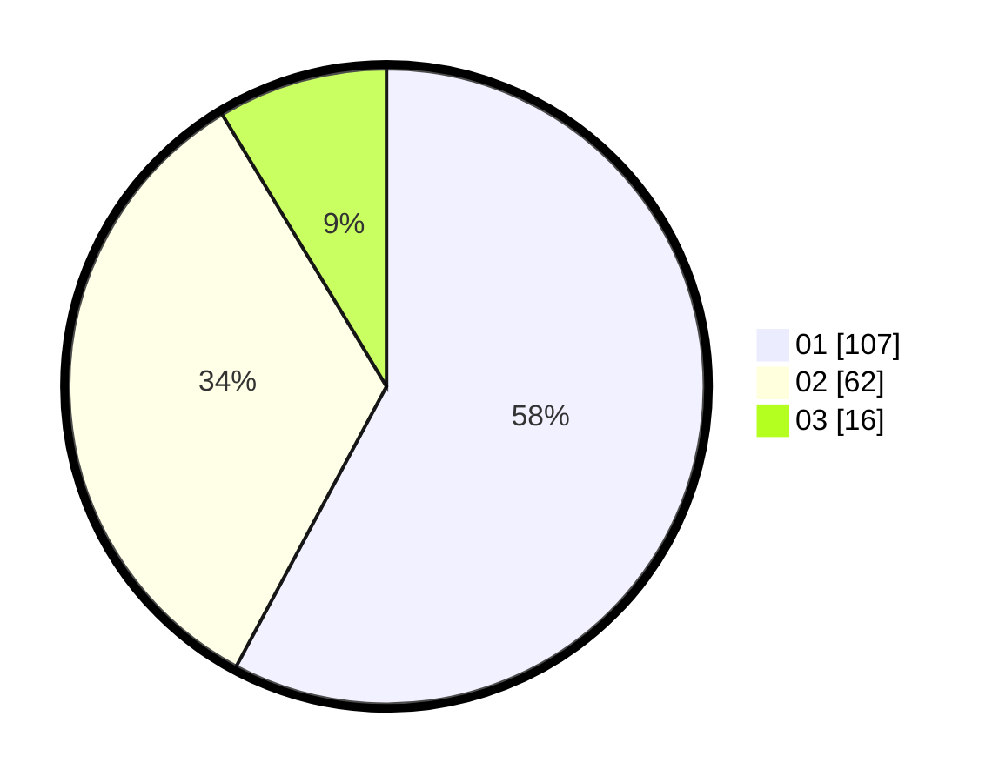

# Hasil

Hasil perolehan suara paslon dapat dilihat pada file paslon-01.txt, paslon-02.txt, dan paslon-03.txt.

Jika tidak ada, artinya data tersebut belum ada pada SIREKAP.

## Perolehan Suara

 * Paslon 01: **107**.
 * Paslon 02: **62**.
 * Paslon 03: **16**.

## Foto C Plano

https://sirekap-obj-formc.kpu.go.id/a39b/pemilu/ppwp/31/74/09/10/01/3174091001088-20240215-014815--e495d5ea-6566-4218-8d0b-fd75d032bba0.jpg

https://sirekap-obj-formc.kpu.go.id/a39b/pemilu/ppwp/31/74/09/10/01/3174091001088-20240215-014837--814ac305-75d0-44ee-9634-3c5a1f89ee28.jpg

https://sirekap-obj-formc.kpu.go.id/a39b/pemilu/ppwp/31/74/09/10/01/3174091001088-20240215-014859--3b4dbf39-65c3-42dc-ac27-91a0763a1c56.jpg
