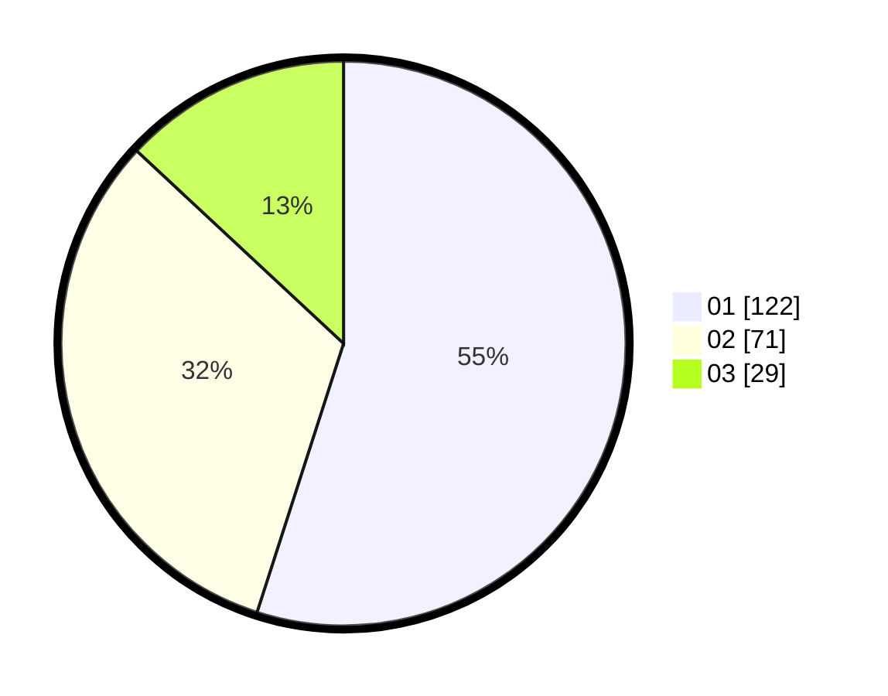

# Hasil

Hasil perolehan suara paslon dapat dilihat pada file paslon-01.txt, paslon-02.txt, dan paslon-03.txt.

Jika tidak ada, artinya data tersebut belum ada pada SIREKAP.

## Perolehan Suara

 * Paslon 01: **122**.
 * Paslon 02: **71**.
 * Paslon 03: **29**.

## Foto C Plano

https://sirekap-obj-formc.kpu.go.id/f642/pemilu/ppwp/31/74/09/10/01/3174091001097-20240214-234723--cf73b991-5d46-4ebe-8873-181dc208ae3b.jpg

https://sirekap-obj-formc.kpu.go.id/f642/pemilu/ppwp/31/74/09/10/01/3174091001097-20240214-203823--8d1699d1-5bd7-497b-8ecd-cd9e0ce6b1f3.jpg

https://sirekap-obj-formc.kpu.go.id/f642/pemilu/ppwp/31/74/09/10/01/3174091001097-20240214-235101--ae060337-68e9-4bc3-a7b8-76601d91b6bf.jpg

## DATA PEMILIH TETAP

Jumlah pemilih dalam DPT: **264**.
 * L: **129**.
 * P: **135**.

## DATA PENGGUNA HAK PILIH

Jumlah pengguna hak pilih dalam DPT: **223**.
 * L: **107**.
 * P: **116**.

Jumlah pengguna hak pilih dalam DPTb: **1**.
 * L: **1**.
 * P: **0**.

Jumlah pengguna hak pilih dalam DPK: **0**.
 * L: **0**.
 * P: **0**.

Jumlah pengguna hak pilih: **224**.
 * L: **108**.
 * P: **116**.

## JUMLAH SUARA SAH DAN TIDAK SAH

JUMLAH SELURUH SUARA SAH: **222**.

JUMLAH SUARA TIDAK SAH: **2**.

JUMLAH SELURUH SUARA SAH DAN SUARA TIDAK SAH: **224**.
