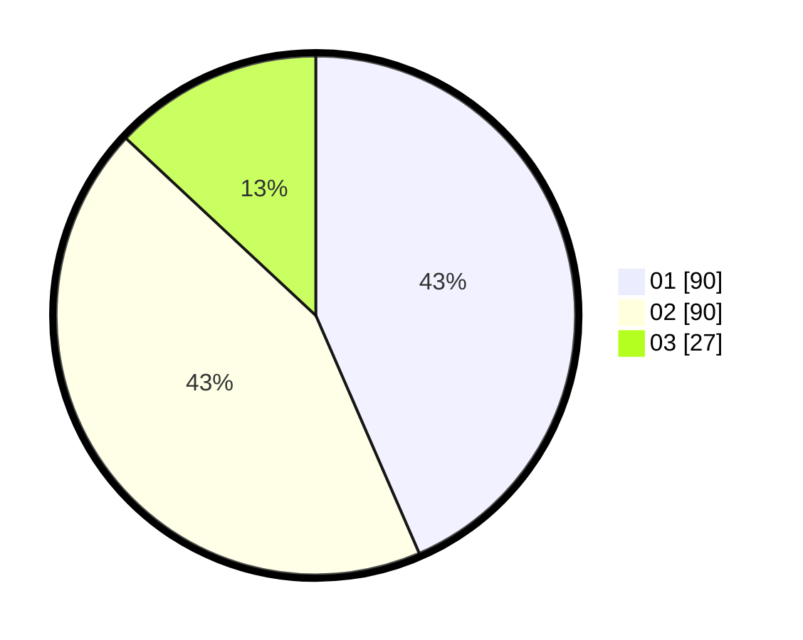

# Hasil

Hasil perolehan suara paslon dapat dilihat pada file paslon-01.txt, paslon-02.txt, dan paslon-03.txt.

Jika tidak ada, artinya data tersebut belum ada pada SIREKAP.

## Perolehan Suara

 * Paslon 01: **90**.
 * Paslon 02: **90**.
 * Paslon 03: **27**.

## Foto C Plano

https://sirekap-obj-formc.kpu.go.id/789c/pemilu/ppwp/31/74/09/10/01/3174091001106-20240214-155029--ed158fa5-a929-4e5c-9c84-3e5f5ebc3cd4.jpg

https://sirekap-obj-formc.kpu.go.id/789c/pemilu/ppwp/31/74/09/10/01/3174091001106-20240214-155433--124b7efc-3adb-46dd-a338-e21b3a418083.jpg

https://sirekap-obj-formc.kpu.go.id/789c/pemilu/ppwp/31/74/09/10/01/3174091001106-20240214-155753--92426aba-a36a-4413-b8dc-b17d4729b366.jpg

## DATA PEMILIH TETAP

Jumlah pemilih dalam DPT: **252**.
 * L: **123**.
 * P: **129**.

## DATA PENGGUNA HAK PILIH

Jumlah pengguna hak pilih dalam DPT: **205**.
 * L: **98**.
 * P: **107**.

Jumlah pengguna hak pilih dalam DPTb: **4**.
 * L: **2**.
 * P: **2**.

Jumlah pengguna hak pilih dalam DPK: **0**.
 * L: **0**.
 * P: **0**.

Jumlah pengguna hak pilih: **209**.
 * L: **100**.
 * P: **109**.

## JUMLAH SUARA SAH DAN TIDAK SAH

JUMLAH SELURUH SUARA SAH: **207**.

JUMLAH SUARA TIDAK SAH: **2**.

JUMLAH SELURUH SUARA SAH DAN SUARA TIDAK SAH: **209**.
