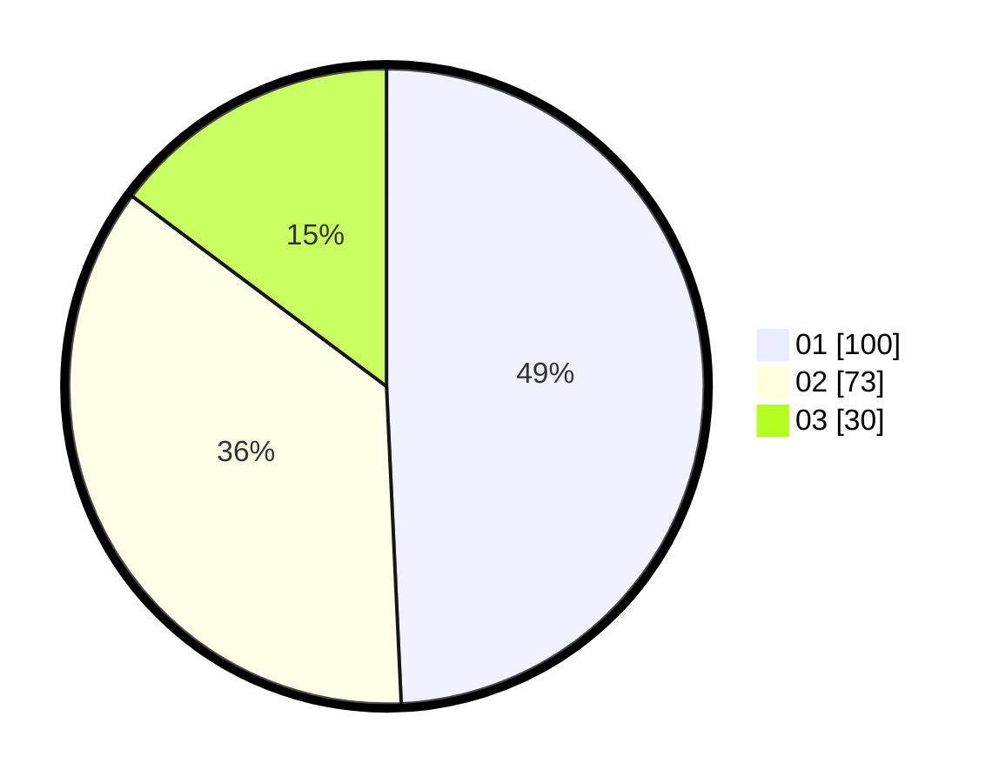

# Hasil

Hasil perolehan suara paslon dapat dilihat pada file paslon-01.txt, paslon-02.txt, dan paslon-03.txt.

Jika tidak ada, artinya data tersebut belum ada pada SIREKAP.

## Perolehan Suara

 * Paslon 01: **100**.
 * Paslon 02: **73**.
 * Paslon 03: **30**.

## Foto C Plano

https://sirekap-obj-formc.kpu.go.id/6415/pemilu/ppwp/31/74/09/10/01/3174091001107-20240214-155623--280f6029-cb65-48dd-8782-896b544fa2a6.jpg

https://sirekap-obj-formc.kpu.go.id/6415/pemilu/ppwp/31/74/09/10/01/3174091001107-20240214-155709--2fae6455-deeb-426f-b871-f7acf808ab7d.jpg

https://sirekap-obj-formc.kpu.go.id/6415/pemilu/ppwp/31/74/09/10/01/3174091001107-20240214-155806--48a274bb-0c2c-4c67-87db-0e37d6cc3c21.jpg

## DATA PEMILIH TETAP

Jumlah pemilih dalam DPT: **253**.
 * L: **134**.
 * P: **119**.

## DATA PENGGUNA HAK PILIH

Jumlah pengguna hak pilih dalam DPT: **204**.
 * L: **102**.
 * P: **102**.

Jumlah pengguna hak pilih dalam DPTb: **0**.
 * L: **0**.
 * P: **0**.

Jumlah pengguna hak pilih dalam DPK: **2**.
 * L: **1**.
 * P: **1**.

Jumlah pengguna hak pilih: **206**.
 * L: **103**.
 * P: **103**.

## JUMLAH SUARA SAH DAN TIDAK SAH

JUMLAH SELURUH SUARA SAH: **203**.

JUMLAH SUARA TIDAK SAH: **3**.

JUMLAH SELURUH SUARA SAH DAN SUARA TIDAK SAH: **206**.
