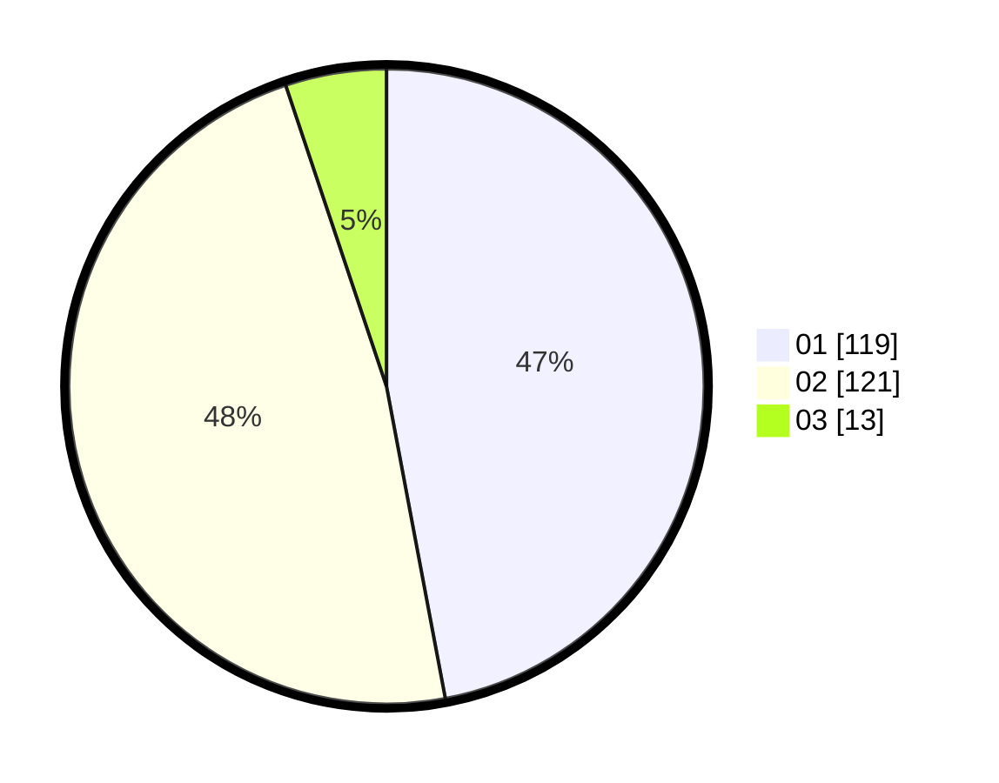

# Hasil

Hasil perolehan suara paslon dapat dilihat pada file paslon-01.txt, paslon-02.txt, dan paslon-03.txt.

Jika tidak ada, artinya data tersebut belum ada pada SIREKAP.

## Perolehan Suara

 * Paslon 01: **119**.
 * Paslon 02: **121**.
 * Paslon 03: **13**.

## Foto C Plano

https://sirekap-obj-formc.kpu.go.id/7b51/pemilu/ppwp/31/74/09/10/01/3174091001111-20240216-123603--b534ef36-a15a-4997-810c-db8437fd2e19.jpg

https://sirekap-obj-formc.kpu.go.id/7b51/pemilu/ppwp/31/74/09/10/01/3174091001111-20240216-132744--b7172bd9-2486-4be3-885e-32fd6914ae0e.jpg

https://sirekap-obj-formc.kpu.go.id/7b51/pemilu/ppwp/31/74/09/10/01/3174091001111-20240216-133508--d6dab57b-8068-49b8-b2c5-a115fa52e0c9.jpg

## DATA PEMILIH TETAP

Jumlah pemilih dalam DPT: **300**.
 * L: **155**.
 * P: **145**.

## DATA PENGGUNA HAK PILIH

Jumlah pengguna hak pilih dalam DPT: **247**.
 * L: **125**.
 * P: **122**.

Jumlah pengguna hak pilih dalam DPTb: **1**.
 * L: **1**.
 * P: **0**.

Jumlah pengguna hak pilih dalam DPK: **5**.
 * L: **3**.
 * P: **2**.

Jumlah pengguna hak pilih: **253**.
 * L: **129**.
 * P: **124**.

## JUMLAH SUARA SAH DAN TIDAK SAH

JUMLAH SELURUH SUARA SAH: **253**.

JUMLAH SUARA TIDAK SAH: **0**.

JUMLAH SELURUH SUARA SAH DAN SUARA TIDAK SAH: **253**.
