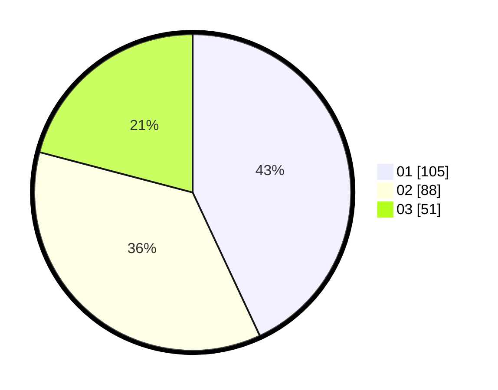

# Hasil

Hasil perolehan suara paslon dapat dilihat pada file paslon-01.txt, paslon-02.txt, dan paslon-03.txt.

Jika tidak ada, artinya data tersebut belum ada pada SIREKAP.

## Perolehan Suara

 * Paslon 01: **105**.
 * Paslon 02: **88**.
 * Paslon 03: **51**.

## Foto C Plano

https://sirekap-obj-formc.kpu.go.id/2a40/pemilu/ppwp/31/74/09/10/01/3174091001113-20240216-094145--93b9d578-d1b6-4fbe-b666-9f2fec651abe.jpg

https://sirekap-obj-formc.kpu.go.id/2a40/pemilu/ppwp/31/74/09/10/01/3174091001113-20240216-094146--c53b2d25-432e-4c60-9751-0ae5ff14084b.jpg

https://sirekap-obj-formc.kpu.go.id/2a40/pemilu/ppwp/31/74/09/10/01/3174091001113-20240216-094145--9c411877-038c-40b7-92ea-bd578bd39fe8.jpg

## DATA PEMILIH TETAP

Jumlah pemilih dalam DPT: **290**.
 * L: **143**.
 * P: **147**.

## DATA PENGGUNA HAK PILIH

Jumlah pengguna hak pilih dalam DPT: **245**.
 * L: **117**.
 * P: **128**.

Jumlah pengguna hak pilih dalam DPTb: **2**.
 * L: **1**.
 * P: **1**.

Jumlah pengguna hak pilih dalam DPK: **3**.
 * L: **0**.
 * P: **3**.

Jumlah pengguna hak pilih: **250**.
 * L: **118**.
 * P: **132**.

## JUMLAH SUARA SAH DAN TIDAK SAH

JUMLAH SELURUH SUARA SAH: **244**.

JUMLAH SUARA TIDAK SAH: **6**.

JUMLAH SELURUH SUARA SAH DAN SUARA TIDAK SAH: **250**.
