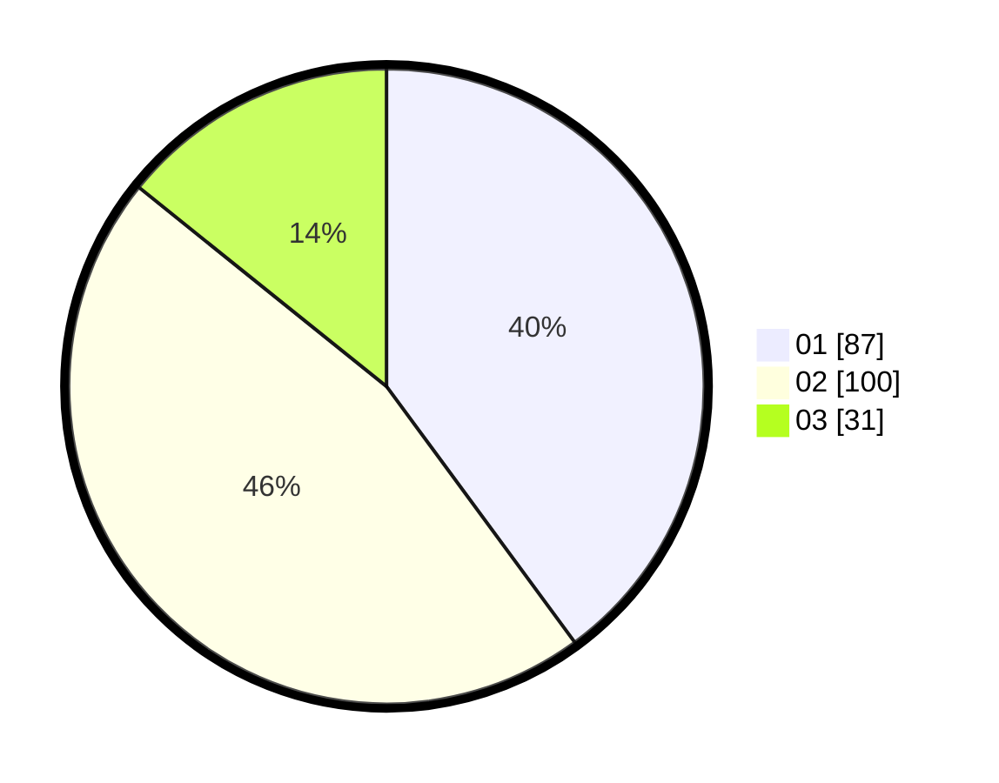

# Hasil

Hasil perolehan suara paslon dapat dilihat pada file paslon-01.txt, paslon-02.txt, dan paslon-03.txt.

Jika tidak ada, artinya data tersebut belum ada pada SIREKAP.

## Perolehan Suara

 * Paslon 01: **87**.
 * Paslon 02: **100**.
 * Paslon 03: **31**.

## Foto C Plano

https://sirekap-obj-formc.kpu.go.id/6029/pemilu/ppwp/31/74/09/10/01/3174091001125-20240216-152635--de9140e3-8f37-4966-a1de-453ae6eb8f51.jpg

https://sirekap-obj-formc.kpu.go.id/6029/pemilu/ppwp/31/74/09/10/01/3174091001125-20240215-024049--7050ddc8-a590-48ec-b904-f679f35fb550.jpg

https://sirekap-obj-formc.kpu.go.id/6029/pemilu/ppwp/31/74/09/10/01/3174091001125-20240215-024143--05c9bb3a-b761-4890-af42-0a7d49d19ed2.jpg
