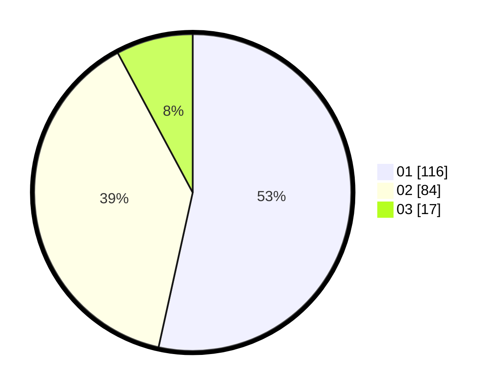

# Hasil

Hasil perolehan suara paslon dapat dilihat pada file paslon-01.txt, paslon-02.txt, dan paslon-03.txt.

Jika tidak ada, artinya data tersebut belum ada pada SIREKAP.

## Perolehan Suara

 * Paslon 01: **116**.
 * Paslon 02: **84**.
 * Paslon 03: **17**.

## Foto C Plano

https://sirekap-obj-formc.kpu.go.id/c59b/pemilu/ppwp/31/74/09/10/01/3174091001133-20240216-073507--1710432a-6318-434a-aee1-7706a2a80f49.jpg

https://sirekap-obj-formc.kpu.go.id/c59b/pemilu/ppwp/31/74/09/10/01/3174091001133-20240216-073511--6ab67e95-83cc-4099-8366-e7e8011f64e9.jpg

https://sirekap-obj-formc.kpu.go.id/c59b/pemilu/ppwp/31/74/09/10/01/3174091001133-20240216-073509--e1f3734e-d587-4f17-95b4-e44ba0f6a51a.jpg

## DATA PEMILIH TETAP

Jumlah pemilih dalam DPT: **249**.
 * L: **117**.
 * P: **132**.

## DATA PENGGUNA HAK PILIH

Jumlah pengguna hak pilih dalam DPT: **209**.
 * L: **91**.
 * P: **118**.

Jumlah pengguna hak pilih dalam DPTb: **8**.
 * L: **2**.
 * P: **6**.

Jumlah pengguna hak pilih dalam DPK: **3**.
 * L: **1**.
 * P: **2**.

Jumlah pengguna hak pilih: **220**.
 * L: **94**.
 * P: **126**.

## JUMLAH SUARA SAH DAN TIDAK SAH

JUMLAH SELURUH SUARA SAH: **217**.

JUMLAH SUARA TIDAK SAH: **3**.

JUMLAH SELURUH SUARA SAH DAN SUARA TIDAK SAH: **220**.
