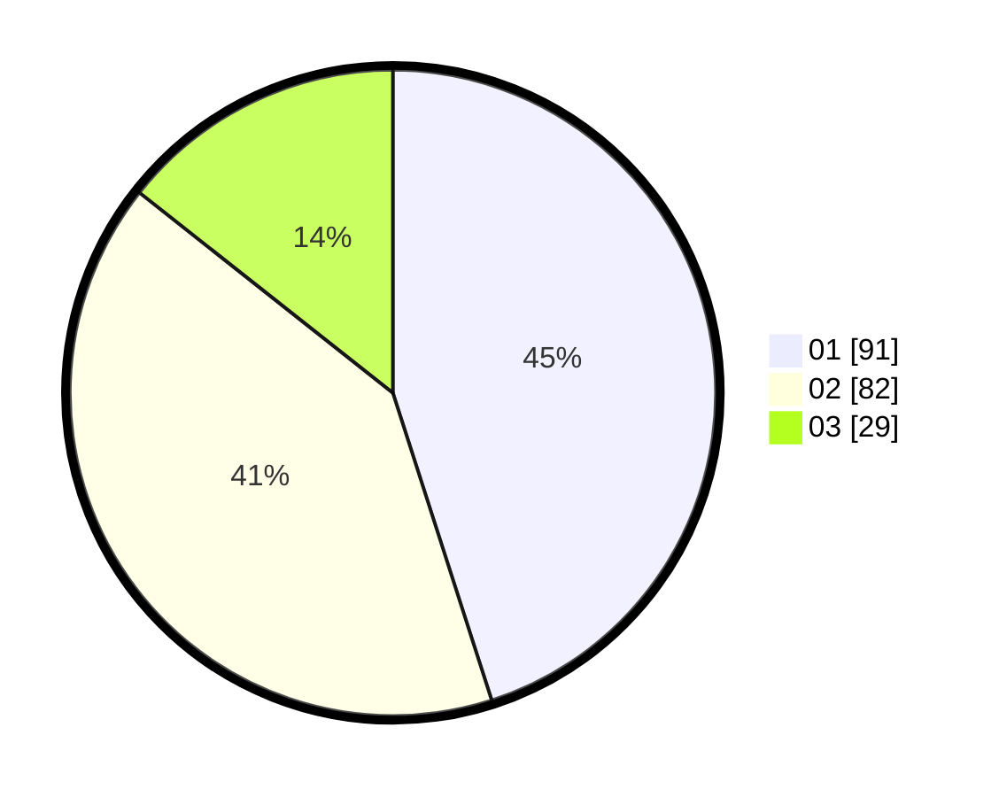

# Hasil

Hasil perolehan suara paslon dapat dilihat pada file paslon-01.txt, paslon-02.txt, dan paslon-03.txt.

Jika tidak ada, artinya data tersebut belum ada pada SIREKAP.

## Perolehan Suara

 * Paslon 01: **91**.
 * Paslon 02: **82**.
 * Paslon 03: **29**.

## Foto C Plano

https://sirekap-obj-formc.kpu.go.id/60df/pemilu/ppwp/31/74/09/10/01/3174091001134-20240214-200703--34f97d56-e28b-4806-94a8-38a9bc925694.jpg

https://sirekap-obj-formc.kpu.go.id/60df/pemilu/ppwp/31/74/09/10/01/3174091001134-20240214-200918--8024e968-8008-46d8-a48d-f1e461ca7562.jpg

https://sirekap-obj-formc.kpu.go.id/60df/pemilu/ppwp/31/74/09/10/01/3174091001134-20240214-201046--36c253a9-f436-42e4-b085-075f808268e5.jpg

## DATA PEMILIH TETAP

Jumlah pemilih dalam DPT: **246**.
 * L: **127**.
 * P: **119**.

## DATA PENGGUNA HAK PILIH

Jumlah pengguna hak pilih dalam DPT: **198**.
 * L: **95**.
 * P: **103**.

Jumlah pengguna hak pilih dalam DPTb: **2**.
 * L: **1**.
 * P: **1**.

Jumlah pengguna hak pilih dalam DPK: **2**.
 * L: **1**.
 * P: **1**.

Jumlah pengguna hak pilih: **202**.
 * L: **97**.
 * P: **105**.

## JUMLAH SUARA SAH DAN TIDAK SAH

JUMLAH SELURUH SUARA SAH: **202**.

JUMLAH SUARA TIDAK SAH: **0**.

JUMLAH SELURUH SUARA SAH DAN SUARA TIDAK SAH: **202**.
