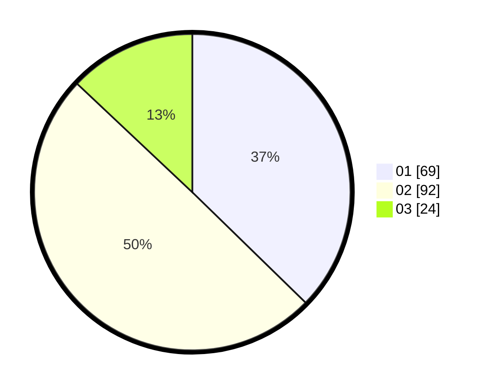

# Hasil

Hasil perolehan suara paslon dapat dilihat pada file paslon-01.txt, paslon-02.txt, dan paslon-03.txt.

Jika tidak ada, artinya data tersebut belum ada pada SIREKAP.

## Perolehan Suara

 * Paslon 01: **69**.
 * Paslon 02: **92**.
 * Paslon 03: **24**.

## Foto C Plano

https://sirekap-obj-formc.kpu.go.id/08c5/pemilu/ppwp/31/74/09/10/01/3174091001138-20240214-210836--11b0ad00-f0f8-40b5-a793-89c13ddf24d5.jpg

https://sirekap-obj-formc.kpu.go.id/08c5/pemilu/ppwp/31/74/09/10/01/3174091001138-20240214-205228--3c4995a0-d05e-4d09-af23-c3f1ec2df29f.jpg

https://sirekap-obj-formc.kpu.go.id/08c5/pemilu/ppwp/31/74/09/10/01/3174091001138-20240214-205352--b5eb9262-1178-452f-a2fd-729aec2a0036.jpg

## DATA PEMILIH TETAP

Jumlah pemilih dalam DPT: **257**.
 * L: **126**.
 * P: **131**.

## DATA PENGGUNA HAK PILIH

Jumlah pengguna hak pilih dalam DPT: **186**.
 * L: **93**.
 * P: **93**.

Jumlah pengguna hak pilih dalam DPTb: **1**.
 * L: **1**.
 * P: **0**.

Jumlah pengguna hak pilih dalam DPK: **0**.
 * L: **0**.
 * P: **0**.

Jumlah pengguna hak pilih: **187**.
 * L: **94**.
 * P: **93**.

## JUMLAH SUARA SAH DAN TIDAK SAH

JUMLAH SELURUH SUARA SAH: **185**.

JUMLAH SUARA TIDAK SAH: **2**.

JUMLAH SELURUH SUARA SAH DAN SUARA TIDAK SAH: **187**.
