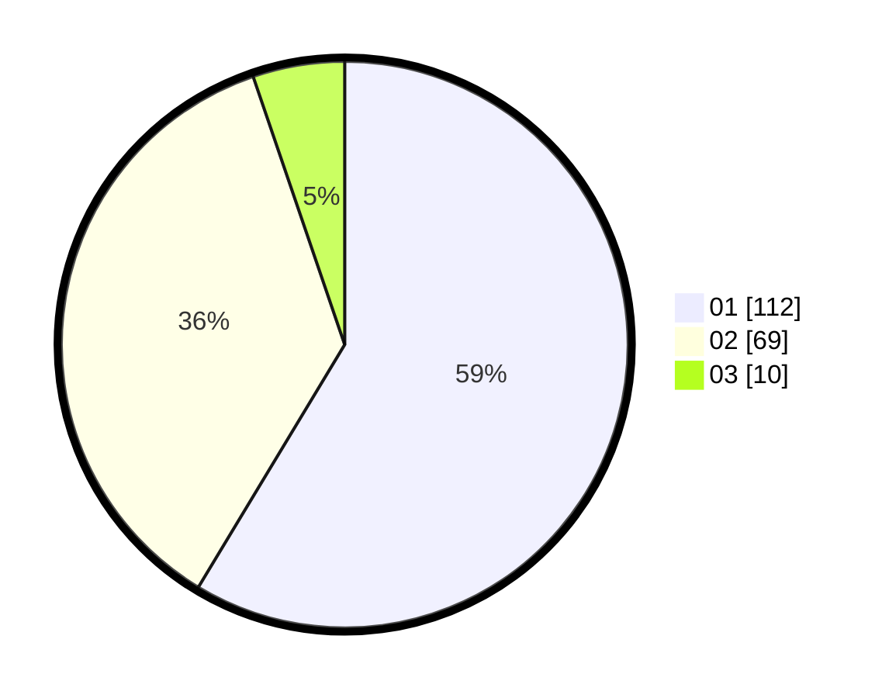

# Hasil

Hasil perolehan suara paslon dapat dilihat pada file paslon-01.txt, paslon-02.txt, dan paslon-03.txt.

Jika tidak ada, artinya data tersebut belum ada pada SIREKAP.

## Perolehan Suara

 * Paslon 01: **112**.
 * Paslon 02: **69**.
 * Paslon 03: **10**.

## Foto C Plano

https://sirekap-obj-formc.kpu.go.id/194c/pemilu/ppwp/31/74/09/10/01/3174091001143-20240215-233354--cb08ae62-699b-4de4-bdfe-479ec128e695.jpg

https://sirekap-obj-formc.kpu.go.id/194c/pemilu/ppwp/31/74/09/10/01/3174091001143-20240215-233356--bddfad69-3718-427f-8976-1d6e6c028899.jpg

https://sirekap-obj-formc.kpu.go.id/194c/pemilu/ppwp/31/74/09/10/01/3174091001143-20240215-233355--8171143e-ddb6-463e-a4af-ff38a77aa03e.jpg

## DATA PEMILIH TETAP

Jumlah pemilih dalam DPT: **237**.
 * L: **117**.
 * P: **120**.

## DATA PENGGUNA HAK PILIH

Jumlah pengguna hak pilih dalam DPT: **192**.
 * L: **92**.
 * P: **100**.

Jumlah pengguna hak pilih dalam DPTb: **1**.
 * L: **0**.
 * P: **1**.

Jumlah pengguna hak pilih dalam DPK: **0**.
 * L: **0**.
 * P: **0**.

Jumlah pengguna hak pilih: **193**.
 * L: **92**.
 * P: **101**.

## JUMLAH SUARA SAH DAN TIDAK SAH

JUMLAH SELURUH SUARA SAH: **191**.

JUMLAH SUARA TIDAK SAH: **2**.

JUMLAH SELURUH SUARA SAH DAN SUARA TIDAK SAH: **193**.
