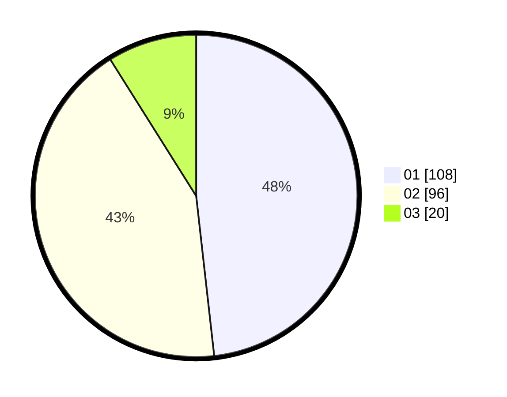

# Hasil

Hasil perolehan suara paslon dapat dilihat pada file paslon-01.txt, paslon-02.txt, dan paslon-03.txt.

Jika tidak ada, artinya data tersebut belum ada pada SIREKAP.

## Perolehan Suara

 * Paslon 01: **108**.
 * Paslon 02: **96**.
 * Paslon 03: **20**.

## Foto C Plano

https://sirekap-obj-formc.kpu.go.id/63f3/pemilu/ppwp/31/74/09/10/01/3174091001148-20240215-010505--de5e090e-4840-4d7e-a417-e712d216129f.jpg

https://sirekap-obj-formc.kpu.go.id/63f3/pemilu/ppwp/31/74/09/10/01/3174091001148-20240215-010509--2596b778-e0bd-4d3d-a208-5ce24dfef889.jpg

https://sirekap-obj-formc.kpu.go.id/63f3/pemilu/ppwp/31/74/09/10/01/3174091001148-20240215-010513--c51104f3-61b2-45b1-aa16-399dd273fd22.jpg

## DATA PEMILIH TETAP

Jumlah pemilih dalam DPT: **287**.
 * L: **146**.
 * P: **141**.

## DATA PENGGUNA HAK PILIH

Jumlah pengguna hak pilih dalam DPT: **225**.
 * L: **110**.
 * P: **115**.

Jumlah pengguna hak pilih dalam DPTb: **1**.
 * L: **1**.
 * P: **0**.

Jumlah pengguna hak pilih dalam DPK: **0**.
 * L: **0**.
 * P: **0**.

Jumlah pengguna hak pilih: **226**.
 * L: **111**.
 * P: **115**.

## JUMLAH SUARA SAH DAN TIDAK SAH

JUMLAH SELURUH SUARA SAH: **224**.

JUMLAH SUARA TIDAK SAH: **2**.

JUMLAH SELURUH SUARA SAH DAN SUARA TIDAK SAH: **226**.
