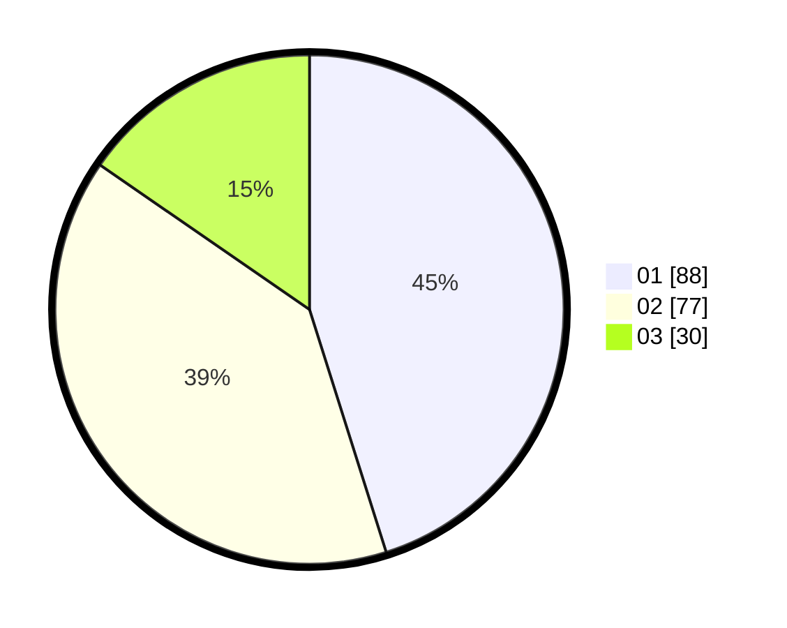

# Hasil

Hasil perolehan suara paslon dapat dilihat pada file paslon-01.txt, paslon-02.txt, dan paslon-03.txt.

Jika tidak ada, artinya data tersebut belum ada pada SIREKAP.

## Perolehan Suara

 * Paslon 01: **88**.
 * Paslon 02: **77**.
 * Paslon 03: **30**.

## Foto C Plano

https://sirekap-obj-formc.kpu.go.id/6e77/pemilu/ppwp/31/74/09/10/01/3174091001152-20240214-191750--8bc281fd-e24b-42e4-a588-9f5eb4d4302e.jpg

https://sirekap-obj-formc.kpu.go.id/6e77/pemilu/ppwp/31/74/09/10/01/3174091001152-20240214-140946--2cbd9a88-0167-41bf-9746-e165878271be.jpg

https://sirekap-obj-formc.kpu.go.id/6e77/pemilu/ppwp/31/74/09/10/01/3174091001152-20240214-141401--0414c5a5-09a0-4bb6-b8f2-2566eab33ec7.jpg
