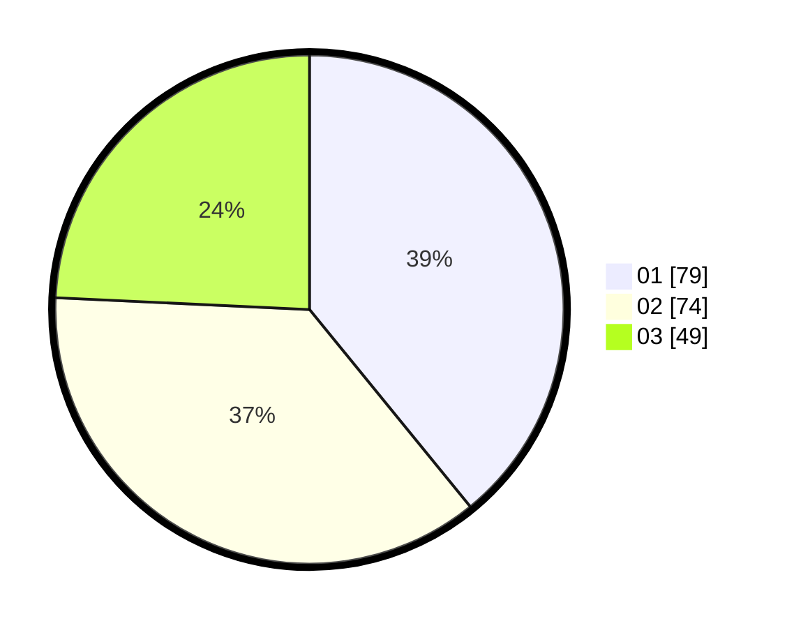

# Hasil

Hasil perolehan suara paslon dapat dilihat pada file paslon-01.txt, paslon-02.txt, dan paslon-03.txt.

Jika tidak ada, artinya data tersebut belum ada pada SIREKAP.

## Perolehan Suara

 * Paslon 01: **79**.
 * Paslon 02: **74**.
 * Paslon 03: **49**.

## Foto C Plano

https://sirekap-obj-formc.kpu.go.id/a619/pemilu/ppwp/31/74/09/10/01/3174091001164-20240216-212634--1bfe2d93-fa76-4fc2-81d5-4c8c6aa6dff1.jpg

https://sirekap-obj-formc.kpu.go.id/a619/pemilu/ppwp/31/74/09/10/01/3174091001164-20240216-212635--bb1221ce-8f9c-479a-9132-be07bdf1f8c3.jpg

https://sirekap-obj-formc.kpu.go.id/a619/pemilu/ppwp/31/74/09/10/01/3174091001164-20240216-212634--05733a2b-703e-4b0e-8203-e6aee7404713.jpg

## DATA PEMILIH TETAP

Jumlah pemilih dalam DPT: **245**.
 * L: **128**.
 * P: **117**.

## DATA PENGGUNA HAK PILIH

Jumlah pengguna hak pilih dalam DPT: **205**.
 * L: **109**.
 * P: **96**.

Jumlah pengguna hak pilih dalam DPTb: **0**.
 * L: **0**.
 * P: **0**.

Jumlah pengguna hak pilih dalam DPK: **0**.
 * L: **0**.
 * P: **0**.

Jumlah pengguna hak pilih: **205**.
 * L: **109**.
 * P: **96**.

## JUMLAH SUARA SAH DAN TIDAK SAH

JUMLAH SELURUH SUARA SAH: **202**.

JUMLAH SUARA TIDAK SAH: **3**.

JUMLAH SELURUH SUARA SAH DAN SUARA TIDAK SAH: **205**.
