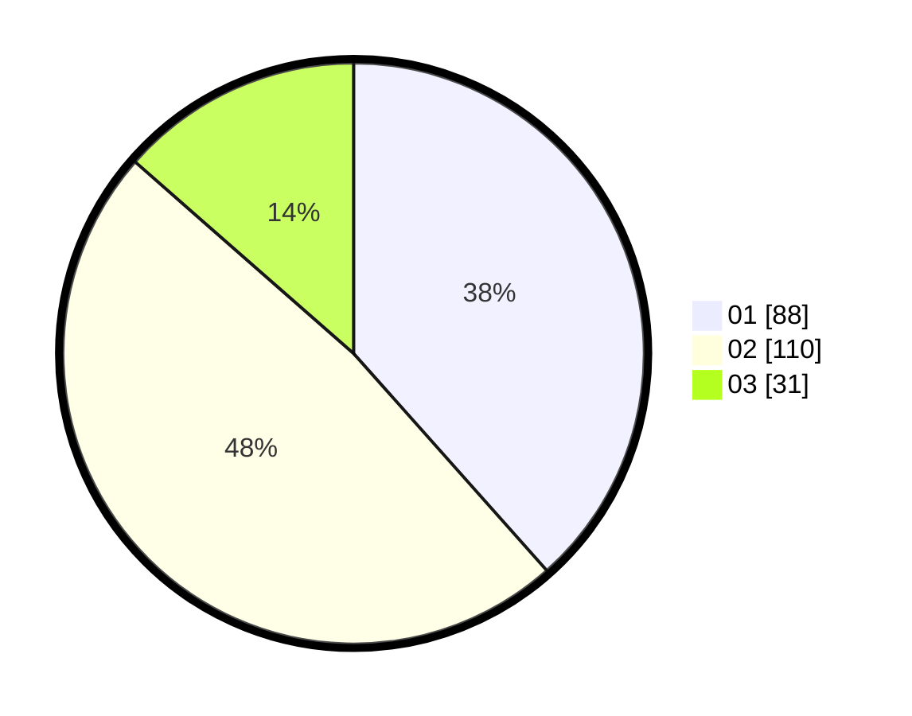

# Hasil

Hasil perolehan suara paslon dapat dilihat pada file paslon-01.txt, paslon-02.txt, dan paslon-03.txt.

Jika tidak ada, artinya data tersebut belum ada pada SIREKAP.

## Perolehan Suara

 * Paslon 01: **88**.
 * Paslon 02: **110**.
 * Paslon 03: **31**.

## Foto C Plano

https://sirekap-obj-formc.kpu.go.id/7cf9/pemilu/ppwp/31/74/09/10/01/3174091001180-20240214-223956--9f2562c7-9d39-49ac-8cce-2bfe50c39c92.jpg

https://sirekap-obj-formc.kpu.go.id/7cf9/pemilu/ppwp/31/74/09/10/01/3174091001180-20240214-223940--a5745674-35f3-439a-b60d-f03128fcb45c.jpg

https://sirekap-obj-formc.kpu.go.id/7cf9/pemilu/ppwp/31/74/09/10/01/3174091001180-20240214-223857--2dd0a7e6-0335-40e6-82b3-ce700b82711a.jpg

## DATA PEMILIH TETAP

Jumlah pemilih dalam DPT: **299**.
 * L: **149**.
 * P: **150**.

## DATA PENGGUNA HAK PILIH

Jumlah pengguna hak pilih dalam DPT: **299**.
 * L: **149**.
 * P: **150**.

Jumlah pengguna hak pilih dalam DPTb: **2**.
 * L: **0**.
 * P: **2**.

Jumlah pengguna hak pilih dalam DPK: **2**.
 * L: **1**.
 * P: **1**.

Jumlah pengguna hak pilih: **230**.
 * L: **107**.
 * P: **123**.

## JUMLAH SUARA SAH DAN TIDAK SAH

JUMLAH SELURUH SUARA SAH: **229**.

JUMLAH SUARA TIDAK SAH: **1**.

JUMLAH SELURUH SUARA SAH DAN SUARA TIDAK SAH: **230**.
