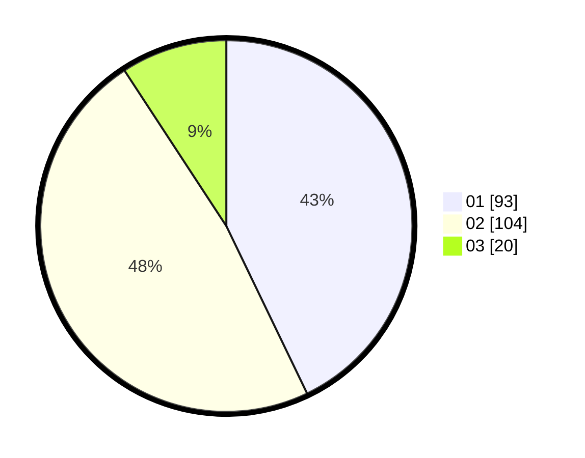

# Hasil

Hasil perolehan suara paslon dapat dilihat pada file paslon-01.txt, paslon-02.txt, dan paslon-03.txt.

Jika tidak ada, artinya data tersebut belum ada pada SIREKAP.

## Perolehan Suara

 * Paslon 01: **93**.
 * Paslon 02: **104**.
 * Paslon 03: **20**.

## Foto C Plano

https://sirekap-obj-formc.kpu.go.id/0229/pemilu/ppwp/31/74/09/10/01/3174091001182-20240215-022627--1c85a650-bf87-4ac9-8b91-abb828b0ebc6.jpg

https://sirekap-obj-formc.kpu.go.id/0229/pemilu/ppwp/31/74/09/10/01/3174091001182-20240214-225759--8bb15025-9c84-4404-a846-f78430b07a42.jpg

https://sirekap-obj-formc.kpu.go.id/0229/pemilu/ppwp/31/74/09/10/01/3174091001182-20240214-225920--aec0f0ed-34b5-4eaa-83ba-9fe3588157a5.jpg
