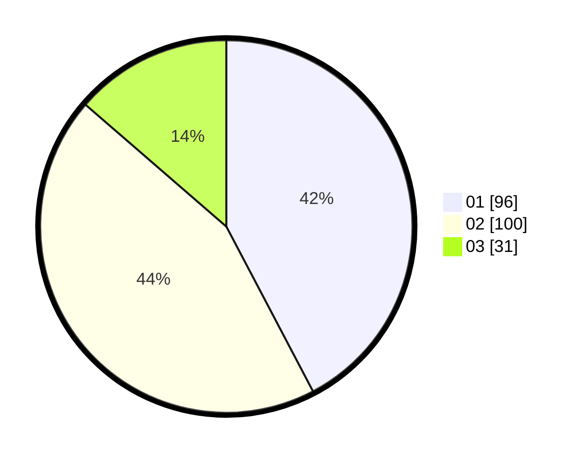

# Hasil

Hasil perolehan suara paslon dapat dilihat pada file paslon-01.txt, paslon-02.txt, dan paslon-03.txt.

Jika tidak ada, artinya data tersebut belum ada pada SIREKAP.

## Perolehan Suara

 * Paslon 01: **96**.
 * Paslon 02: **100**.
 * Paslon 03: **31**.

## Foto C Plano

https://sirekap-obj-formc.kpu.go.id/aec1/pemilu/ppwp/31/74/09/10/01/3174091001184-20240214-225327--1155be7d-5f79-477c-b737-3d4dd8c0c5fa.jpg

https://sirekap-obj-formc.kpu.go.id/aec1/pemilu/ppwp/31/74/09/10/01/3174091001184-20240214-225501--6c9188fa-683e-4f24-8e09-918e5d595712.jpg

https://sirekap-obj-formc.kpu.go.id/aec1/pemilu/ppwp/31/74/09/10/01/3174091001184-20240214-225551--7d1f13ff-d152-4b24-aad7-525230932e8a.jpg
