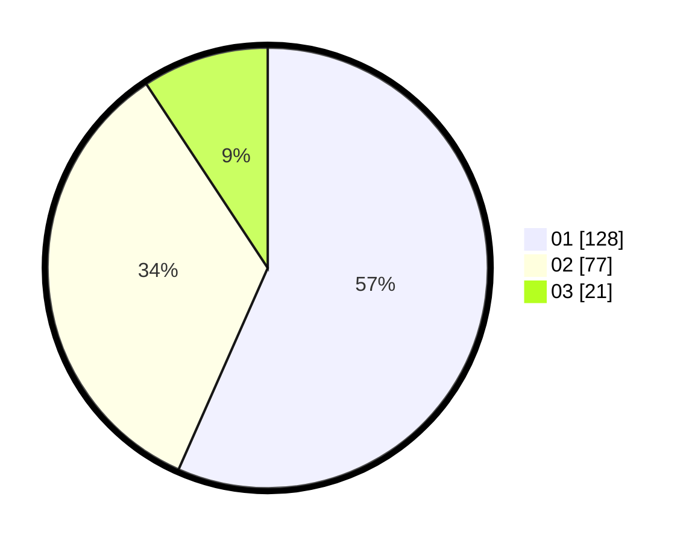

# Hasil

Hasil perolehan suara paslon dapat dilihat pada file paslon-01.txt, paslon-02.txt, dan paslon-03.txt.

Jika tidak ada, artinya data tersebut belum ada pada SIREKAP.

## Perolehan Suara

 * Paslon 01: **128**.
 * Paslon 02: **77**.
 * Paslon 03: **21**.

## Foto C Plano

https://sirekap-obj-formc.kpu.go.id/a623/pemilu/ppwp/31/74/09/10/01/3174091001190-20240214-204810--6200cf7b-b34a-4283-8998-6cd3901b959b.jpg

https://sirekap-obj-formc.kpu.go.id/a623/pemilu/ppwp/31/74/09/10/01/3174091001190-20240214-204832--a3653a2e-e051-446d-8fd4-3e01e24af79b.jpg

https://sirekap-obj-formc.kpu.go.id/a623/pemilu/ppwp/31/74/09/10/01/3174091001190-20240214-204820--3b958acf-9410-4956-a73d-4e7afbf6662b.jpg

## DATA PEMILIH TETAP

Jumlah pemilih dalam DPT: **258**.
 * L: **126**.
 * P: **132**.

## DATA PENGGUNA HAK PILIH

Jumlah pengguna hak pilih dalam DPT: **213**.
 * L: **102**.
 * P: **111**.

Jumlah pengguna hak pilih dalam DPTb: **12**.
 * L: **5**.
 * P: **7**.

Jumlah pengguna hak pilih dalam DPK: **3**.
 * L: **1**.
 * P: **2**.

Jumlah pengguna hak pilih: **228**.
 * L: **108**.
 * P: **120**.

## JUMLAH SUARA SAH DAN TIDAK SAH

JUMLAH SELURUH SUARA SAH: **226**.

JUMLAH SUARA TIDAK SAH: **2**.

JUMLAH SELURUH SUARA SAH DAN SUARA TIDAK SAH: **228**.
