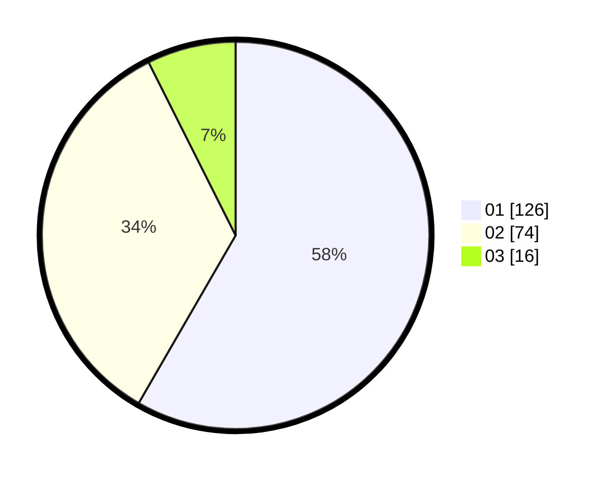

# Hasil

Hasil perolehan suara paslon dapat dilihat pada file paslon-01.txt, paslon-02.txt, dan paslon-03.txt.

Jika tidak ada, artinya data tersebut belum ada pada SIREKAP.

## Perolehan Suara

 * Paslon 01: **126**.
 * Paslon 02: **74**.
 * Paslon 03: **16**.

## Foto C Plano

https://sirekap-obj-formc.kpu.go.id/ef0c/pemilu/ppwp/31/74/09/10/01/3174091001191-20240217-113400--3fc675dc-5f12-429d-a2be-d35fc39163c4.jpg

https://sirekap-obj-formc.kpu.go.id/ef0c/pemilu/ppwp/31/74/09/10/01/3174091001191-20240214-215734--eae9615b-a2ed-4982-8cda-6ee5611f839c.jpg

https://sirekap-obj-formc.kpu.go.id/ef0c/pemilu/ppwp/31/74/09/10/01/3174091001191-20240214-215554--bcbf212e-cadb-4934-b514-60e3386465a4.jpg

## DATA PEMILIH TETAP

Jumlah pemilih dalam DPT: **265**.
 * L: **128**.
 * P: **137**.

## DATA PENGGUNA HAK PILIH

Jumlah pengguna hak pilih dalam DPT: **211**.
 * L: **100**.
 * P: **111**.

Jumlah pengguna hak pilih dalam DPTb: **4**.
 * L: **2**.
 * P: **2**.

Jumlah pengguna hak pilih dalam DPK: **4**.
 * L: **1**.
 * P: **3**.

Jumlah pengguna hak pilih: **219**.
 * L: **103**.
 * P: **116**.

## JUMLAH SUARA SAH DAN TIDAK SAH

JUMLAH SELURUH SUARA SAH: **216**.

JUMLAH SUARA TIDAK SAH: **3**.

JUMLAH SELURUH SUARA SAH DAN SUARA TIDAK SAH: **219**.
