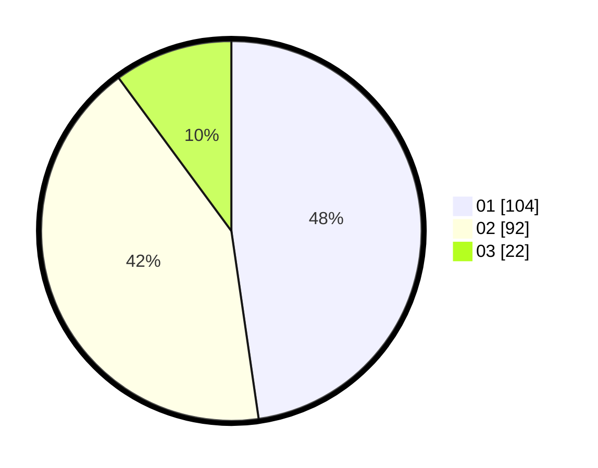

# Hasil

Hasil perolehan suara paslon dapat dilihat pada file paslon-01.txt, paslon-02.txt, dan paslon-03.txt.

Jika tidak ada, artinya data tersebut belum ada pada SIREKAP.

## Perolehan Suara

 * Paslon 01: **104**.
 * Paslon 02: **92**.
 * Paslon 03: **22**.

## Foto C Plano

https://sirekap-obj-formc.kpu.go.id/1c8b/pemilu/ppwp/31/74/09/10/01/3174091001204-20240215-062859--39c163f6-53c4-48ba-a95c-6a3f72b8e8ce.jpg

https://sirekap-obj-formc.kpu.go.id/1c8b/pemilu/ppwp/31/74/09/10/01/3174091001204-20240215-062910--a50738db-f584-4a87-b0c1-4e53df0a8a02.jpg

https://sirekap-obj-formc.kpu.go.id/1c8b/pemilu/ppwp/31/74/09/10/01/3174091001204-20240214-185733--dc20518f-86ac-4c4a-aa04-4e5160b73f7a.jpg

## DATA PEMILIH TETAP

Jumlah pemilih dalam DPT: **257**.
 * L: **122**.
 * P: **135**.

## DATA PENGGUNA HAK PILIH

Jumlah pengguna hak pilih dalam DPT: **219**.
 * L: **105**.
 * P: **114**.

Jumlah pengguna hak pilih dalam DPTb: **0**.
 * L: **0**.
 * P: **0**.

Jumlah pengguna hak pilih dalam DPK: **2**.
 * L: **1**.
 * P: **1**.

Jumlah pengguna hak pilih: **221**.
 * L: **106**.
 * P: **115**.

## JUMLAH SUARA SAH DAN TIDAK SAH

JUMLAH SELURUH SUARA SAH: **218**.

JUMLAH SUARA TIDAK SAH: **3**.

JUMLAH SELURUH SUARA SAH DAN SUARA TIDAK SAH: **221**.
