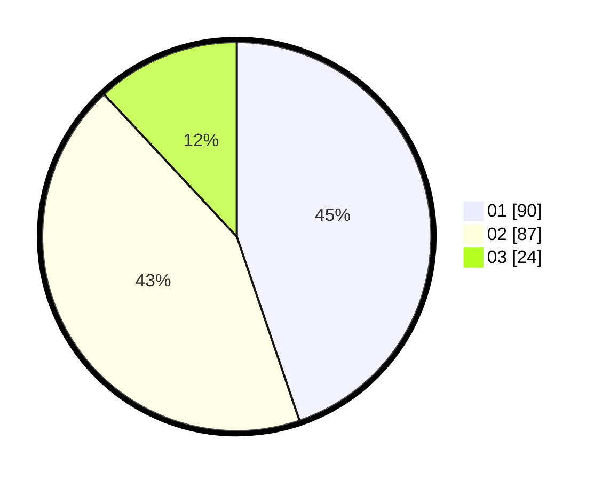

# Hasil

Hasil perolehan suara paslon dapat dilihat pada file paslon-01.txt, paslon-02.txt, dan paslon-03.txt.

Jika tidak ada, artinya data tersebut belum ada pada SIREKAP.

## Perolehan Suara

 * Paslon 01: **90**.
 * Paslon 02: **87**.
 * Paslon 03: **24**.

## Foto C Plano

https://sirekap-obj-formc.kpu.go.id/096b/pemilu/ppwp/31/74/09/10/01/3174091001206-20240214-155844--442c6052-ae4c-4ca0-8f67-c6b70ccf5603.jpg

https://sirekap-obj-formc.kpu.go.id/096b/pemilu/ppwp/31/74/09/10/01/3174091001206-20240214-205727--3e1b0434-4e8b-4ee2-8f0f-295383537deb.jpg

https://sirekap-obj-formc.kpu.go.id/096b/pemilu/ppwp/31/74/09/10/01/3174091001206-20240214-191955--bde1d528-4ada-427b-be4b-c8c683dbe7d8.jpg

## DATA PEMILIH TETAP

Jumlah pemilih dalam DPT: **259**.
 * L: **133**.
 * P: **126**.

## DATA PENGGUNA HAK PILIH

Jumlah pengguna hak pilih dalam DPT: **201**.
 * L: **97**.
 * P: **104**.

Jumlah pengguna hak pilih dalam DPTb: **0**.
 * L: **0**.
 * P: **0**.

Jumlah pengguna hak pilih dalam DPK: **3**.
 * L: **2**.
 * P: **1**.

Jumlah pengguna hak pilih: **204**.
 * L: **99**.
 * P: **105**.

## JUMLAH SUARA SAH DAN TIDAK SAH

JUMLAH SELURUH SUARA SAH: **201**.

JUMLAH SUARA TIDAK SAH: **3**.

JUMLAH SELURUH SUARA SAH DAN SUARA TIDAK SAH: **204**.
