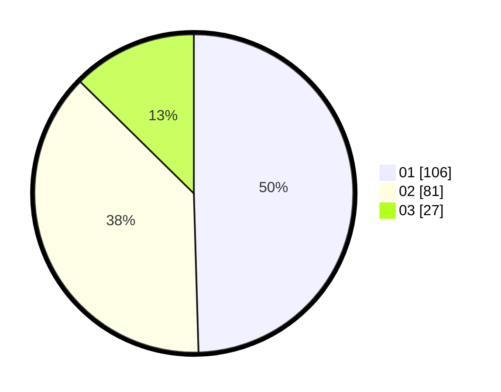

# Hasil

Hasil perolehan suara paslon dapat dilihat pada file paslon-01.txt, paslon-02.txt, dan paslon-03.txt.

Jika tidak ada, artinya data tersebut belum ada pada SIREKAP.

## Perolehan Suara

 * Paslon 01: **106**.
 * Paslon 02: **81**.
 * Paslon 03: **27**.

## Foto C Plano

https://sirekap-obj-formc.kpu.go.id/c26d/pemilu/ppwp/31/74/09/10/01/3174091001210-20240214-204842--b678353e-a041-42e3-9921-2448c48b419f.jpg

https://sirekap-obj-formc.kpu.go.id/c26d/pemilu/ppwp/31/74/09/10/01/3174091001210-20240214-155752--f642c7c4-c755-4d7a-a1e1-195947c1ea47.jpg

https://sirekap-obj-formc.kpu.go.id/c26d/pemilu/ppwp/31/74/09/10/01/3174091001210-20240214-155802--3ca2f23f-7d36-4e41-9384-1f62ebd7f43f.jpg

## DATA PEMILIH TETAP

Jumlah pemilih dalam DPT: **239**.
 * L: **121**.
 * P: **118**.

## DATA PENGGUNA HAK PILIH

Jumlah pengguna hak pilih dalam DPT: **204**.
 * L: **97**.
 * P: **107**.

Jumlah pengguna hak pilih dalam DPTb: **7**.
 * L: **2**.
 * P: **5**.

Jumlah pengguna hak pilih dalam DPK: **6**.
 * L: **3**.
 * P: **3**.

Jumlah pengguna hak pilih: **217**.
 * L: **102**.
 * P: **115**.

## JUMLAH SUARA SAH DAN TIDAK SAH

JUMLAH SELURUH SUARA SAH: **214**.

JUMLAH SUARA TIDAK SAH: **3**.

JUMLAH SELURUH SUARA SAH DAN SUARA TIDAK SAH: **217**.
