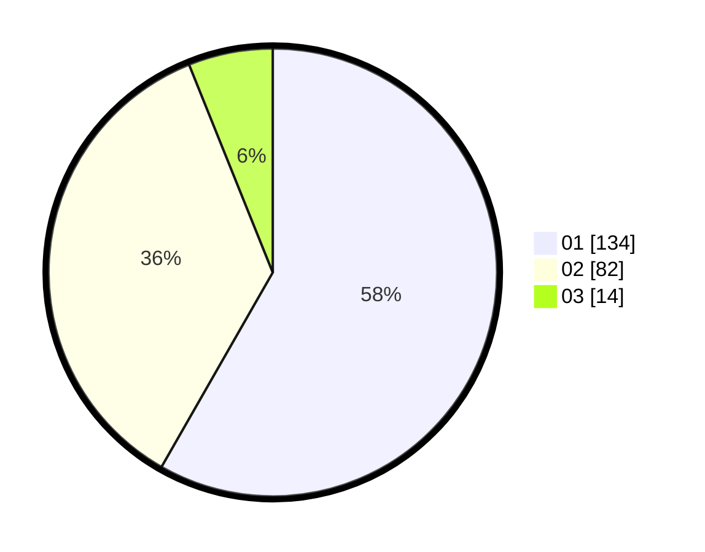

# Hasil

Hasil perolehan suara paslon dapat dilihat pada file paslon-01.txt, paslon-02.txt, dan paslon-03.txt.

Jika tidak ada, artinya data tersebut belum ada pada SIREKAP.

## Perolehan Suara

 * Paslon 01: **134**.
 * Paslon 02: **82**.
 * Paslon 03: **14**.

## Foto C Plano

https://sirekap-obj-formc.kpu.go.id/c328/pemilu/ppwp/31/74/09/10/02/3174091002003-20240216-054329--b94aa2e7-a6c9-4258-8c97-5c55010ff1ab.jpg

https://sirekap-obj-formc.kpu.go.id/c328/pemilu/ppwp/31/74/09/10/02/3174091002003-20240216-054331--86e9e3ee-502b-4eed-bc90-bf034e1f53df.jpg

https://sirekap-obj-formc.kpu.go.id/c328/pemilu/ppwp/31/74/09/10/02/3174091002003-20240216-054330--496c82fe-5aa8-49d2-b703-65cda774545c.jpg

## DATA PEMILIH TETAP

Jumlah pemilih dalam DPT: **279**.
 * L: **137**.
 * P: **142**.

## DATA PENGGUNA HAK PILIH

Jumlah pengguna hak pilih dalam DPT: **233**.
 * L: **112**.
 * P: **121**.

Jumlah pengguna hak pilih dalam DPTb: **1**.
 * L: **1**.
 * P: **0**.

Jumlah pengguna hak pilih dalam DPK: **0**.
 * L: **0**.
 * P: **0**.

Jumlah pengguna hak pilih: **234**.
 * L: **113**.
 * P: **121**.

## JUMLAH SUARA SAH DAN TIDAK SAH

JUMLAH SELURUH SUARA SAH: **230**.

JUMLAH SUARA TIDAK SAH: **4**.

JUMLAH SELURUH SUARA SAH DAN SUARA TIDAK SAH: **234**.
