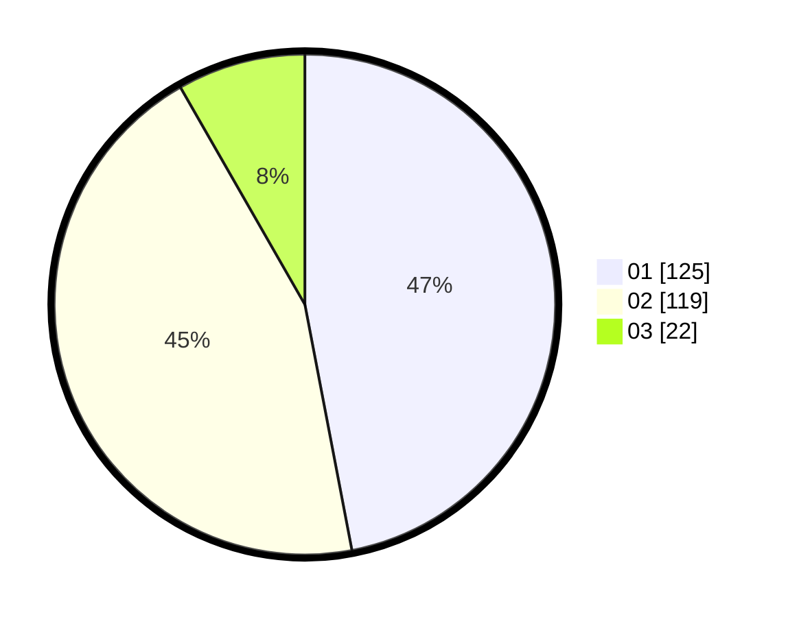

# Hasil

Hasil perolehan suara paslon dapat dilihat pada file paslon-01.txt, paslon-02.txt, dan paslon-03.txt.

Jika tidak ada, artinya data tersebut belum ada pada SIREKAP.

## Perolehan Suara

 * Paslon 01: **125**.
 * Paslon 02: **119**.
 * Paslon 03: **22**.

## Foto C Plano

https://sirekap-obj-formc.kpu.go.id/99c2/pemilu/ppwp/31/74/09/10/02/3174091002019-20240216-054304--b7845bd1-561b-43eb-b3e0-5d839108df99.jpg

https://sirekap-obj-formc.kpu.go.id/99c2/pemilu/ppwp/31/74/09/10/02/3174091002019-20240216-060217--b0a5e859-9768-4425-8d56-c3e6fdea8290.jpg

https://sirekap-obj-formc.kpu.go.id/99c2/pemilu/ppwp/31/74/09/10/02/3174091002019-20240216-054307--4246dc89-b22d-4ffb-b338-dfd8ca7273e4.jpg

## DATA PEMILIH TETAP

Jumlah pemilih dalam DPT: **298**.
 * L: **146**.
 * P: **152**.

## DATA PENGGUNA HAK PILIH

Jumlah pengguna hak pilih dalam DPT: **257**.
 * L: **124**.
 * P: **133**.

Jumlah pengguna hak pilih dalam DPTb: **2**.
 * L: **0**.
 * P: **2**.

Jumlah pengguna hak pilih dalam DPK: **7**.
 * L: **3**.
 * P: **4**.

Jumlah pengguna hak pilih: **266**.
 * L: **127**.
 * P: **139**.

## JUMLAH SUARA SAH DAN TIDAK SAH

JUMLAH SELURUH SUARA SAH: **266**.

JUMLAH SUARA TIDAK SAH: **0**.

JUMLAH SELURUH SUARA SAH DAN SUARA TIDAK SAH: **266**.
