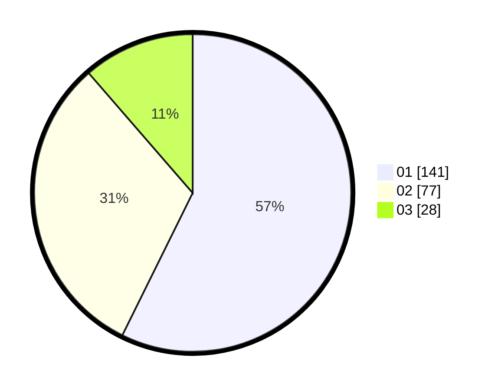

# Hasil

Hasil perolehan suara paslon dapat dilihat pada file paslon-01.txt, paslon-02.txt, dan paslon-03.txt.

Jika tidak ada, artinya data tersebut belum ada pada SIREKAP.

## Perolehan Suara

 * Paslon 01: **141**.
 * Paslon 02: **77**.
 * Paslon 03: **28**.

## Foto C Plano

https://sirekap-obj-formc.kpu.go.id/34a9/pemilu/ppwp/31/74/09/10/02/3174091002028-20240216-011408--b33db770-69f6-47c7-b3fc-64984b5c7735.jpg

https://sirekap-obj-formc.kpu.go.id/34a9/pemilu/ppwp/31/74/09/10/02/3174091002028-20240215-155146--6e48eb0a-53eb-4d1b-afce-0baa05ffe2e3.jpg
