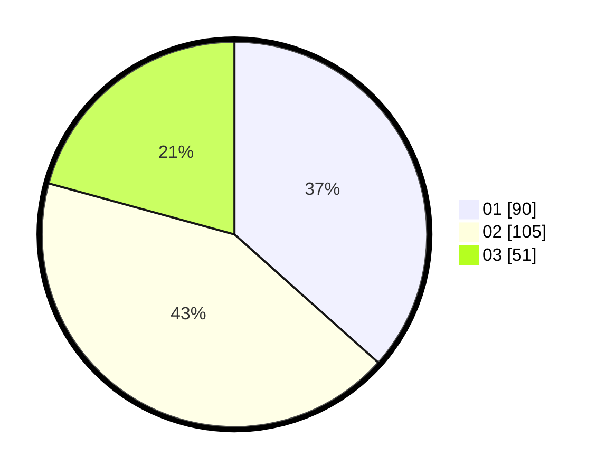

# Hasil

Hasil perolehan suara paslon dapat dilihat pada file paslon-01.txt, paslon-02.txt, dan paslon-03.txt.

Jika tidak ada, artinya data tersebut belum ada pada SIREKAP.

## Perolehan Suara

 * Paslon 01: **90**.
 * Paslon 02: **105**.
 * Paslon 03: **51**.

## Foto C Plano

https://sirekap-obj-formc.kpu.go.id/9053/pemilu/ppwp/31/74/09/10/02/3174091002032-20240214-175329--9df869d7-6fdc-4ba2-b249-d87c093d49f3.jpg

https://sirekap-obj-formc.kpu.go.id/9053/pemilu/ppwp/31/74/09/10/02/3174091002032-20240214-211725--db8284c3-3b8b-468a-bf10-2deffa9a8339.jpg

https://sirekap-obj-formc.kpu.go.id/9053/pemilu/ppwp/31/74/09/10/02/3174091002032-20240214-160056--543889d5-a880-4dfe-94bf-b1b69832b382.jpg

## DATA PEMILIH TETAP

Jumlah pemilih dalam DPT: **289**.
 * L: **133**.
 * P: **156**.

## DATA PENGGUNA HAK PILIH

Jumlah pengguna hak pilih dalam DPT: **249**.
 * L: **109**.
 * P: **140**.

Jumlah pengguna hak pilih dalam DPTb: **1**.
 * L: **0**.
 * P: **1**.

Jumlah pengguna hak pilih dalam DPK: **3**.
 * L: **3**.
 * P: **0**.

Jumlah pengguna hak pilih: **253**.
 * L: **143**.
 * P: **110**.

## JUMLAH SUARA SAH DAN TIDAK SAH

JUMLAH SELURUH SUARA SAH: **246**.

JUMLAH SUARA TIDAK SAH: **5**.

JUMLAH SELURUH SUARA SAH DAN SUARA TIDAK SAH: **251**.
