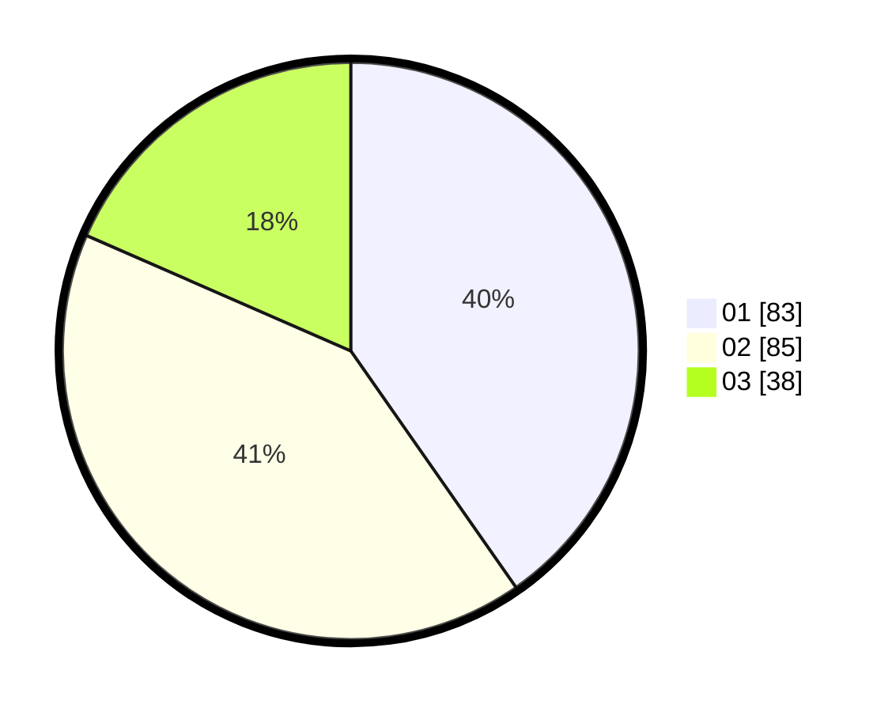

# Hasil

Hasil perolehan suara paslon dapat dilihat pada file paslon-01.txt, paslon-02.txt, dan paslon-03.txt.

Jika tidak ada, artinya data tersebut belum ada pada SIREKAP.

## Perolehan Suara

 * Paslon 01: **83**.
 * Paslon 02: **85**.
 * Paslon 03: **38**.

## Foto C Plano

https://sirekap-obj-formc.kpu.go.id/05c4/pemilu/ppwp/31/74/09/10/02/3174091002047-20240216-161442--9dff4b02-70d6-4396-bf41-376f3da9d2db.jpg

https://sirekap-obj-formc.kpu.go.id/05c4/pemilu/ppwp/31/74/09/10/02/3174091002047-20240214-225035--4ece01bc-5e4e-4098-a006-db0d48961270.jpg

https://sirekap-obj-formc.kpu.go.id/05c4/pemilu/ppwp/31/74/09/10/02/3174091002047-20240216-161343--7448c9c7-18e7-4126-ab40-28ef0a9a3e07.jpg
