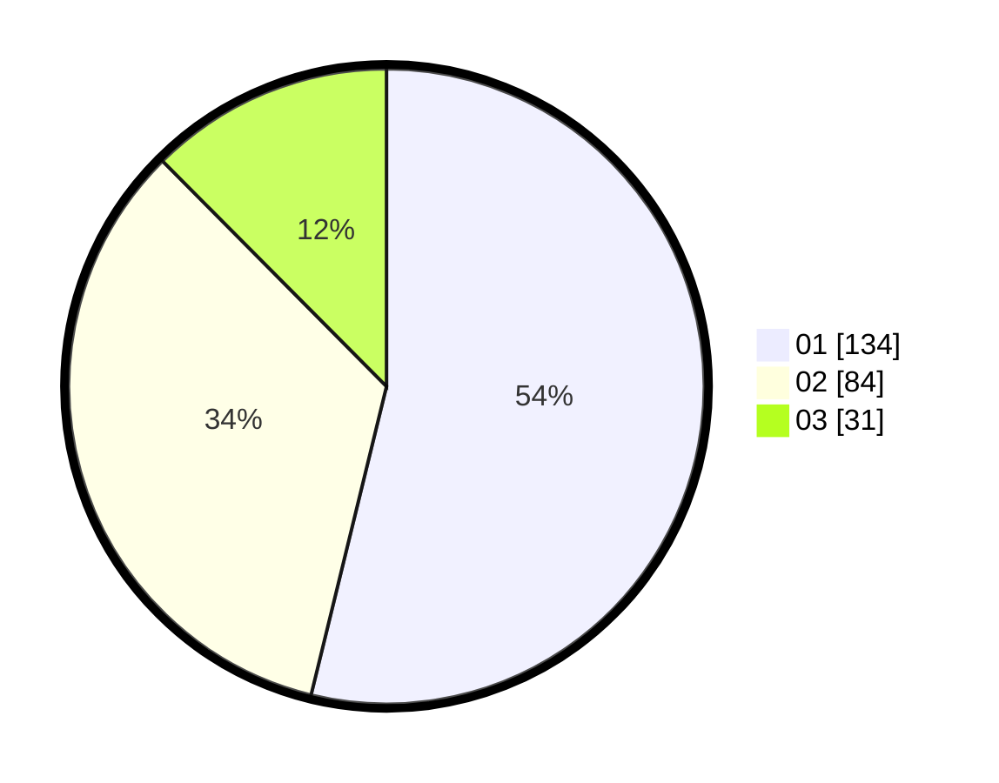

# Hasil

Hasil perolehan suara paslon dapat dilihat pada file paslon-01.txt, paslon-02.txt, dan paslon-03.txt.

Jika tidak ada, artinya data tersebut belum ada pada SIREKAP.

## Perolehan Suara

 * Paslon 01: **134**.
 * Paslon 02: **84**.
 * Paslon 03: **31**.

## Foto C Plano

https://sirekap-obj-formc.kpu.go.id/994a/pemilu/ppwp/31/74/09/10/02/3174091002068-20240216-084140--68751c94-0025-47a7-af03-75200145b29e.jpg

https://sirekap-obj-formc.kpu.go.id/994a/pemilu/ppwp/31/74/09/10/02/3174091002068-20240216-085345--ade74956-53a4-48b6-866f-fb721772b403.jpg

https://sirekap-obj-formc.kpu.go.id/994a/pemilu/ppwp/31/74/09/10/02/3174091002068-20240216-085737--292a544f-f5a9-4acd-baa6-154dd5b6994d.jpg

## DATA PEMILIH TETAP

Jumlah pemilih dalam DPT: **288**.
 * L: **144**.
 * P: **144**.

## DATA PENGGUNA HAK PILIH

Jumlah pengguna hak pilih dalam DPT: **251**.
 * L: **124**.
 * P: **127**.

Jumlah pengguna hak pilih dalam DPTb: **1**.
 * L: **0**.
 * P: **1**.

Jumlah pengguna hak pilih dalam DPK: **3**.
 * L: **2**.
 * P: **1**.

Jumlah pengguna hak pilih: **255**.
 * L: **126**.
 * P: **129**.

## JUMLAH SUARA SAH DAN TIDAK SAH

JUMLAH SELURUH SUARA SAH: **249**.

JUMLAH SUARA TIDAK SAH: **6**.

JUMLAH SELURUH SUARA SAH DAN SUARA TIDAK SAH: **255**.
