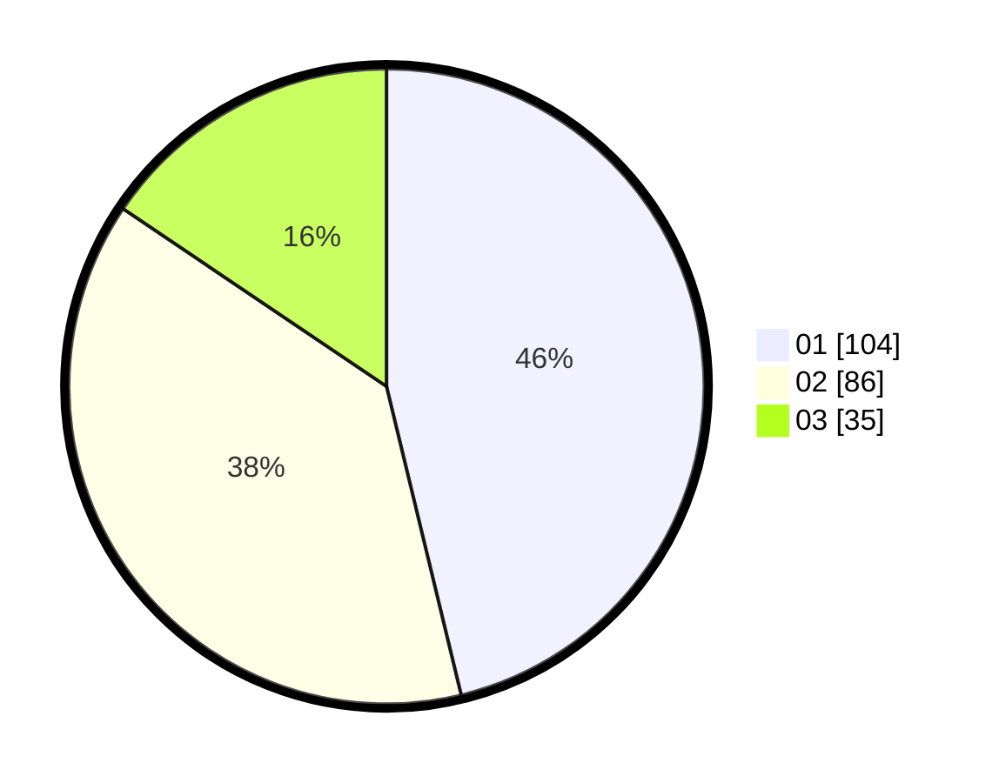

# Hasil

Hasil perolehan suara paslon dapat dilihat pada file paslon-01.txt, paslon-02.txt, dan paslon-03.txt.

Jika tidak ada, artinya data tersebut belum ada pada SIREKAP.

## Perolehan Suara

 * Paslon 01: **104**.
 * Paslon 02: **86**.
 * Paslon 03: **35**.

## Foto C Plano

https://sirekap-obj-formc.kpu.go.id/9ea0/pemilu/ppwp/31/74/09/10/02/3174091002074-20240214-193732--1c938b60-e03c-46a0-aeb6-7a7075c1d19f.jpg

https://sirekap-obj-formc.kpu.go.id/9ea0/pemilu/ppwp/31/74/09/10/02/3174091002074-20240214-223639--4649381d-ca28-4b86-84a8-7fa9fc6bae5d.jpg

https://sirekap-obj-formc.kpu.go.id/9ea0/pemilu/ppwp/31/74/09/10/02/3174091002074-20240214-191542--2e9d0bf7-8017-46fe-b047-459741166faf.jpg

## DATA PEMILIH TETAP

Jumlah pemilih dalam DPT: **289**.
 * L: **138**.
 * P: **151**.

## DATA PENGGUNA HAK PILIH

Jumlah pengguna hak pilih dalam DPT: **223**.
 * L: **97**.
 * P: **126**.

Jumlah pengguna hak pilih dalam DPTb: **3**.
 * L: **1**.
 * P: **2**.

Jumlah pengguna hak pilih dalam DPK: **0**.
 * L: **0**.
 * P: **0**.

Jumlah pengguna hak pilih: **226**.
 * L: **98**.
 * P: **128**.

## JUMLAH SUARA SAH DAN TIDAK SAH

JUMLAH SELURUH SUARA SAH: **225**.

JUMLAH SUARA TIDAK SAH: **1**.

JUMLAH SELURUH SUARA SAH DAN SUARA TIDAK SAH: **226**.
