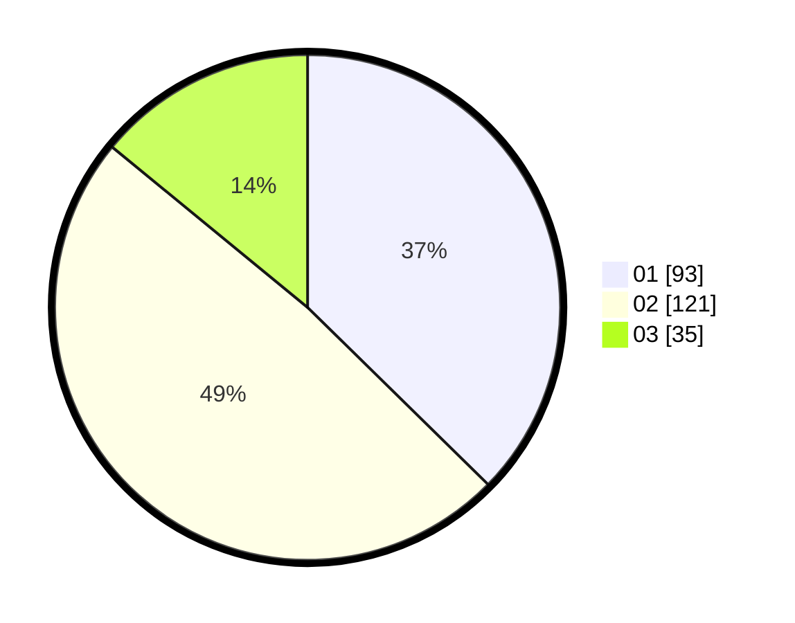

# Hasil

Hasil perolehan suara paslon dapat dilihat pada file paslon-01.txt, paslon-02.txt, dan paslon-03.txt.

Jika tidak ada, artinya data tersebut belum ada pada SIREKAP.

## Perolehan Suara

 * Paslon 01: **93**.
 * Paslon 02: **121**.
 * Paslon 03: **35**.

## Foto C Plano

https://sirekap-obj-formc.kpu.go.id/b042/pemilu/ppwp/31/74/09/10/02/3174091002075-20240214-233252--3c0b509a-ac07-4e74-84e7-a3eb8f24b4d6.jpg

https://sirekap-obj-formc.kpu.go.id/b042/pemilu/ppwp/31/74/09/10/02/3174091002075-20240214-233308--6b3487e8-072c-4137-be5e-81bbae267acf.jpg

https://sirekap-obj-formc.kpu.go.id/b042/pemilu/ppwp/31/74/09/10/02/3174091002075-20240214-233357--79be9d7a-d926-48b5-b6a6-7624a8d62f6d.jpg

## DATA PEMILIH TETAP

Jumlah pemilih dalam DPT: **287**.
 * L: **140**.
 * P: **147**.

## DATA PENGGUNA HAK PILIH

Jumlah pengguna hak pilih dalam DPT: **247**.
 * L: **120**.
 * P: **127**.

Jumlah pengguna hak pilih dalam DPTb: **3**.
 * L: **0**.
 * P: **3**.

Jumlah pengguna hak pilih dalam DPK: **1**.
 * L: **1**.
 * P: **0**.

Jumlah pengguna hak pilih: **251**.
 * L: **121**.
 * P: **130**.

## JUMLAH SUARA SAH DAN TIDAK SAH

JUMLAH SELURUH SUARA SAH: **249**.

JUMLAH SUARA TIDAK SAH: **2**.

JUMLAH SELURUH SUARA SAH DAN SUARA TIDAK SAH: **251**.
