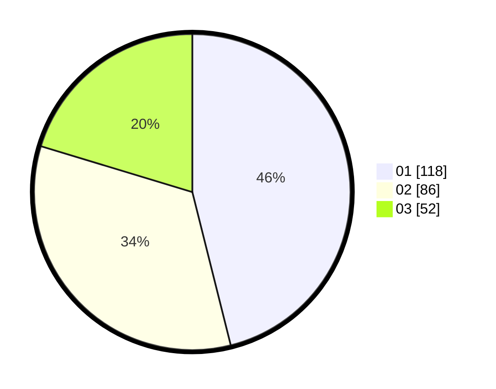

# Hasil

Hasil perolehan suara paslon dapat dilihat pada file paslon-01.txt, paslon-02.txt, dan paslon-03.txt.

Jika tidak ada, artinya data tersebut belum ada pada SIREKAP.

## Perolehan Suara

 * Paslon 01: **118**.
 * Paslon 02: **86**.
 * Paslon 03: **52**.

## Foto C Plano

https://sirekap-obj-formc.kpu.go.id/2f07/pemilu/ppwp/31/74/09/10/02/3174091002078-20240214-185330--bfde0bac-1975-46fb-a1a0-02e75f31fe43.jpg

https://sirekap-obj-formc.kpu.go.id/2f07/pemilu/ppwp/31/74/09/10/02/3174091002078-20240214-185345--700858ee-e598-43ee-9dc3-7c8f41a53368.jpg

https://sirekap-obj-formc.kpu.go.id/2f07/pemilu/ppwp/31/74/09/10/02/3174091002078-20240214-185350--b4c99d25-7e11-42c2-9969-6fd111ebf17f.jpg

## DATA PEMILIH TETAP

Jumlah pemilih dalam DPT: **298**.
 * L: **150**.
 * P: **148**.

## DATA PENGGUNA HAK PILIH

Jumlah pengguna hak pilih dalam DPT: **251**.
 * L: **123**.
 * P: **128**.

Jumlah pengguna hak pilih dalam DPTb: **1**.
 * L: **1**.
 * P: **0**.

Jumlah pengguna hak pilih dalam DPK: **7**.
 * L: **2**.
 * P: **5**.

Jumlah pengguna hak pilih: **259**.
 * L: **126**.
 * P: **133**.

## JUMLAH SUARA SAH DAN TIDAK SAH

JUMLAH SELURUH SUARA SAH: **256**.

JUMLAH SUARA TIDAK SAH: **3**.

JUMLAH SELURUH SUARA SAH DAN SUARA TIDAK SAH: **259**.
