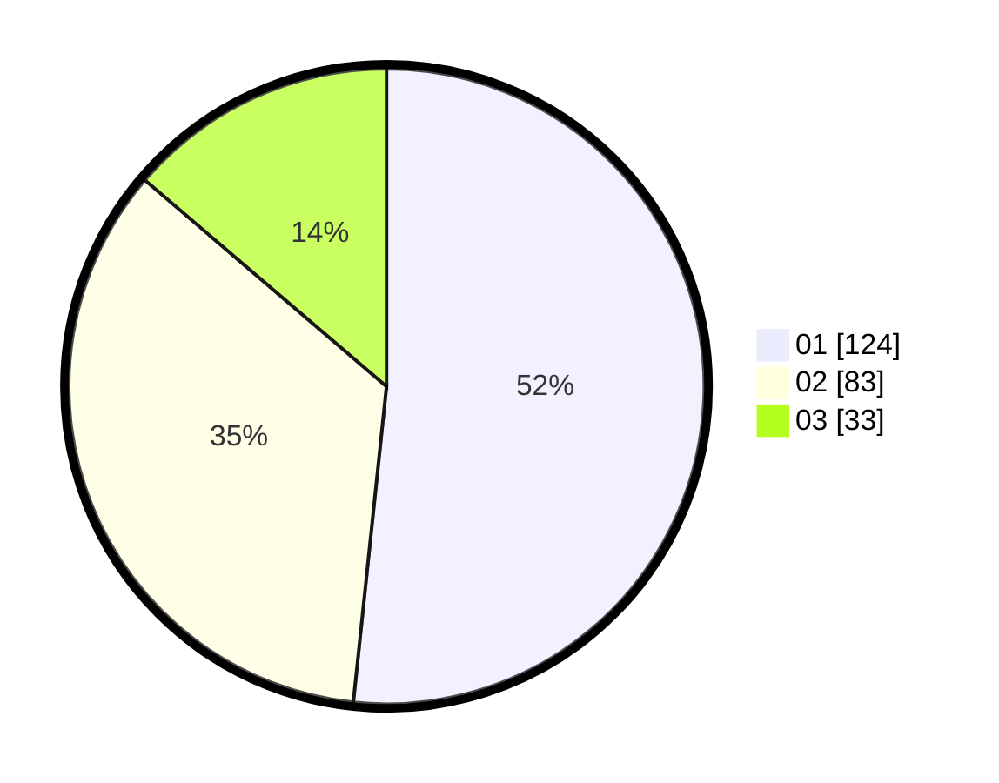

# Hasil

Hasil perolehan suara paslon dapat dilihat pada file paslon-01.txt, paslon-02.txt, dan paslon-03.txt.

Jika tidak ada, artinya data tersebut belum ada pada SIREKAP.

## Perolehan Suara

 * Paslon 01: **124**.
 * Paslon 02: **83**.
 * Paslon 03: **33**.

## Foto C Plano

https://sirekap-obj-formc.kpu.go.id/2a08/pemilu/ppwp/31/74/09/10/02/3174091002080-20240214-155044--1fd475af-8be8-4772-935c-b142b1c80ef6.jpg

https://sirekap-obj-formc.kpu.go.id/2a08/pemilu/ppwp/31/74/09/10/02/3174091002080-20240214-155101--acf3fd62-3451-4617-976b-a74df2e53eae.jpg

https://sirekap-obj-formc.kpu.go.id/2a08/pemilu/ppwp/31/74/09/10/02/3174091002080-20240214-155107--e36dce3d-5457-4d2c-a80b-69e03d2ac323.jpg

## DATA PEMILIH TETAP

Jumlah pemilih dalam DPT: **293**.
 * L: **144**.
 * P: **149**.

## DATA PENGGUNA HAK PILIH

Jumlah pengguna hak pilih dalam DPT: **236**.
 * L: **112**.
 * P: **124**.

Jumlah pengguna hak pilih dalam DPTb: **1**.
 * L: **0**.
 * P: **1**.

Jumlah pengguna hak pilih dalam DPK: **4**.
 * L: **1**.
 * P: **3**.

Jumlah pengguna hak pilih: **241**.
 * L: **113**.
 * P: **128**.

## JUMLAH SUARA SAH DAN TIDAK SAH

JUMLAH SELURUH SUARA SAH: **240**.

JUMLAH SUARA TIDAK SAH: **1**.

JUMLAH SELURUH SUARA SAH DAN SUARA TIDAK SAH: **241**.
