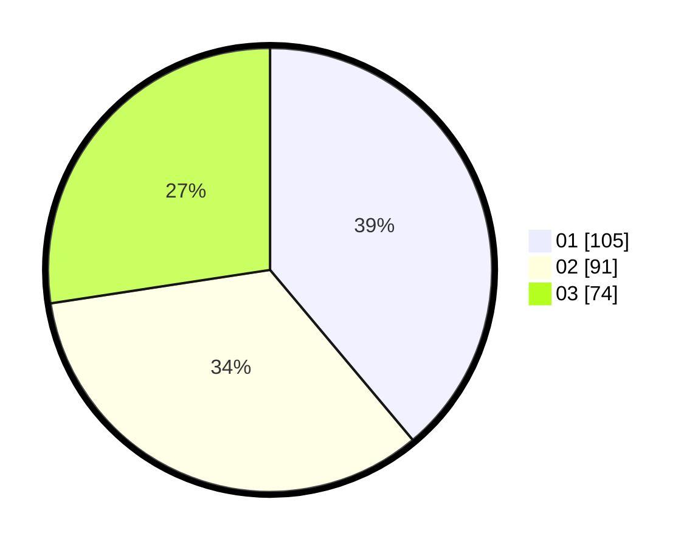

# Hasil

Hasil perolehan suara paslon dapat dilihat pada file paslon-01.txt, paslon-02.txt, dan paslon-03.txt.

Jika tidak ada, artinya data tersebut belum ada pada SIREKAP.

## Perolehan Suara

 * Paslon 01: **105**.
 * Paslon 02: **91**.
 * Paslon 03: **74**.

## Foto C Plano

https://sirekap-obj-formc.kpu.go.id/3a70/pemilu/ppwp/31/74/09/10/02/3174091002085-20240214-190743--81dda9e0-5b73-45e3-acd8-a06769cc82b3.jpg

https://sirekap-obj-formc.kpu.go.id/3a70/pemilu/ppwp/31/74/09/10/02/3174091002085-20240214-190801--8fcbea0b-d466-4f0d-b686-3d6b18f8aea5.jpg

https://sirekap-obj-formc.kpu.go.id/3a70/pemilu/ppwp/31/74/09/10/02/3174091002085-20240214-190808--30a62039-3f58-4fa6-9b83-49032b31470d.jpg

## DATA PEMILIH TETAP

Jumlah pemilih dalam DPT: **275**.
 * L: **136**.
 * P: **139**.

## DATA PENGGUNA HAK PILIH

Jumlah pengguna hak pilih dalam DPT: **231**.
 * L: **115**.
 * P: **116**.

Jumlah pengguna hak pilih dalam DPTb: **2**.
 * L: **1**.
 * P: **1**.

Jumlah pengguna hak pilih dalam DPK: **0**.
 * L: **0**.
 * P: **0**.

Jumlah pengguna hak pilih: **233**.
 * L: **116**.
 * P: **117**.

## JUMLAH SUARA SAH DAN TIDAK SAH

JUMLAH SELURUH SUARA SAH: **230**.

JUMLAH SUARA TIDAK SAH: **3**.

JUMLAH SELURUH SUARA SAH DAN SUARA TIDAK SAH: **233**.
