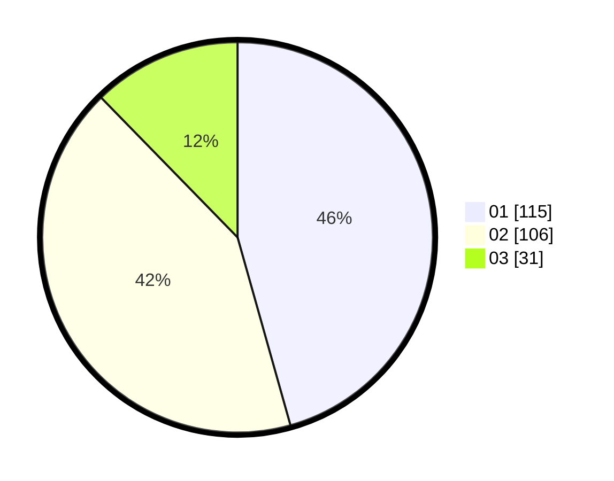

# Hasil

Hasil perolehan suara paslon dapat dilihat pada file paslon-01.txt, paslon-02.txt, dan paslon-03.txt.

Jika tidak ada, artinya data tersebut belum ada pada SIREKAP.

## Perolehan Suara

 * Paslon 01: **115**.
 * Paslon 02: **106**.
 * Paslon 03: **31**.

## Foto C Plano

https://sirekap-obj-formc.kpu.go.id/4742/pemilu/ppwp/31/74/09/10/02/3174091002093-20240214-201018--8332d7d9-b837-4c42-852b-5643f2d5ef06.jpg

https://sirekap-obj-formc.kpu.go.id/4742/pemilu/ppwp/31/74/09/10/02/3174091002093-20240214-201338--30245397-7d34-4f1b-adef-0dd4794f6bdc.jpg

https://sirekap-obj-formc.kpu.go.id/4742/pemilu/ppwp/31/74/09/10/02/3174091002093-20240214-201700--7d8866c2-ad03-448e-94b0-8d8eaee6a09e.jpg

## DATA PEMILIH TETAP

Jumlah pemilih dalam DPT: **273**.
 * L: **128**.
 * P: **145**.

## DATA PENGGUNA HAK PILIH

Jumlah pengguna hak pilih dalam DPT: **246**.
 * L: **114**.
 * P: **132**.

Jumlah pengguna hak pilih dalam DPTb: **2**.
 * L: **1**.
 * P: **1**.

Jumlah pengguna hak pilih dalam DPK: **8**.
 * L: **5**.
 * P: **3**.

Jumlah pengguna hak pilih: **256**.
 * L: **120**.
 * P: **136**.

## JUMLAH SUARA SAH DAN TIDAK SAH

JUMLAH SELURUH SUARA SAH: **252**.

JUMLAH SUARA TIDAK SAH: **4**.

JUMLAH SELURUH SUARA SAH DAN SUARA TIDAK SAH: **256**.
