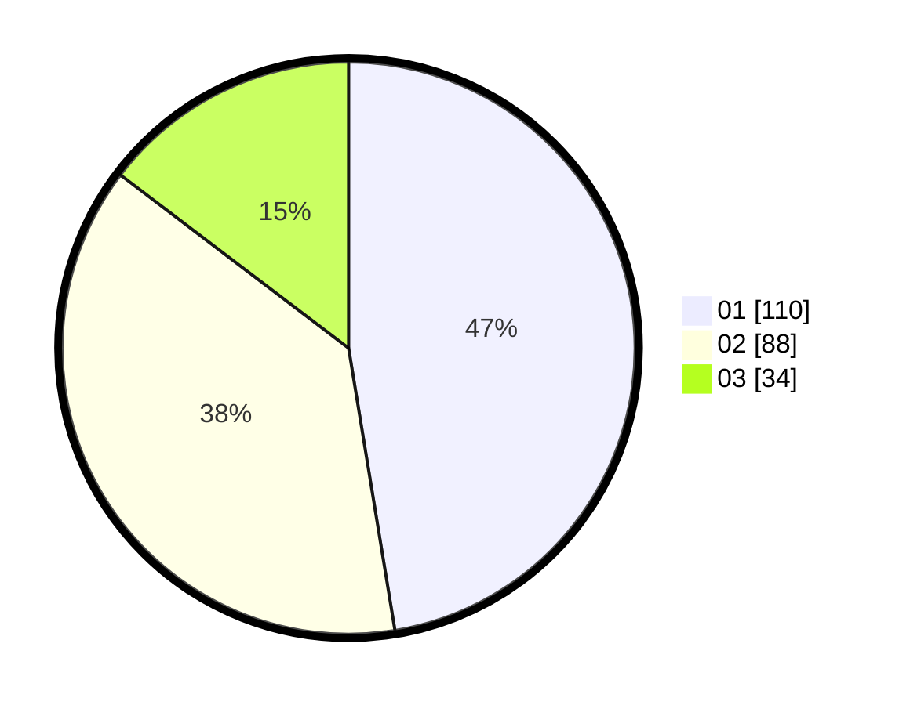

# Hasil

Hasil perolehan suara paslon dapat dilihat pada file paslon-01.txt, paslon-02.txt, dan paslon-03.txt.

Jika tidak ada, artinya data tersebut belum ada pada SIREKAP.

## Perolehan Suara

 * Paslon 01: **110**.
 * Paslon 02: **88**.
 * Paslon 03: **34**.

## Foto C Plano

https://sirekap-obj-formc.kpu.go.id/fa4e/pemilu/ppwp/31/74/09/10/02/3174091002108-20240214-155819--a8facf55-34a7-4c2b-b1d5-33f3daa6df41.jpg

https://sirekap-obj-formc.kpu.go.id/fa4e/pemilu/ppwp/31/74/09/10/02/3174091002108-20240214-192239--6d5a64df-ebed-42ee-a2ca-0a3b8a7b8e48.jpg

https://sirekap-obj-formc.kpu.go.id/fa4e/pemilu/ppwp/31/74/09/10/02/3174091002108-20240214-220446--34c5fb10-edbd-4f9b-a7ba-86ac84f39791.jpg
