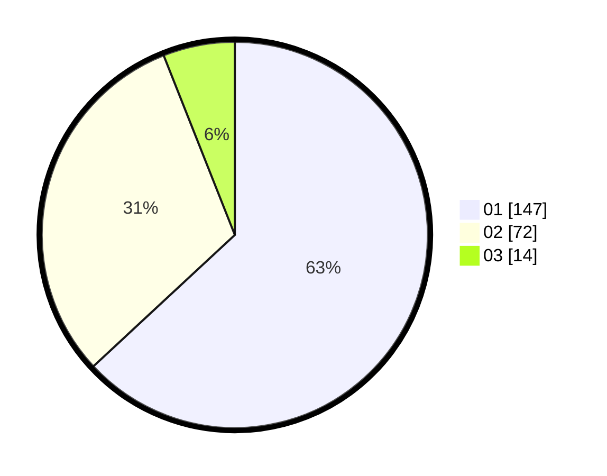

# Hasil

Hasil perolehan suara paslon dapat dilihat pada file paslon-01.txt, paslon-02.txt, dan paslon-03.txt.

Jika tidak ada, artinya data tersebut belum ada pada SIREKAP.

## Perolehan Suara

 * Paslon 01: **147**.
 * Paslon 02: **72**.
 * Paslon 03: **14**.

## Foto C Plano

https://sirekap-obj-formc.kpu.go.id/2bfe/pemilu/ppwp/31/74/09/10/02/3174091002109-20240214-220754--09dcb0a3-a213-4851-aea8-728f84a31b18.jpg

https://sirekap-obj-formc.kpu.go.id/2bfe/pemilu/ppwp/31/74/09/10/02/3174091002109-20240214-220834--a26a3831-089c-4517-9217-4cca12fef31f.jpg

https://sirekap-obj-formc.kpu.go.id/2bfe/pemilu/ppwp/31/74/09/10/02/3174091002109-20240214-220912--9e8ad919-87f0-4205-962e-c84ade24da35.jpg

## DATA PEMILIH TETAP

Jumlah pemilih dalam DPT: **280**.
 * L: **142**.
 * P: **138**.

## DATA PENGGUNA HAK PILIH

Jumlah pengguna hak pilih dalam DPT: **231**.
 * L: **111**.
 * P: **120**.

Jumlah pengguna hak pilih dalam DPTb: **6**.
 * L: **2**.
 * P: **4**.

Jumlah pengguna hak pilih dalam DPK: **0**.
 * L: **0**.
 * P: **0**.

Jumlah pengguna hak pilih: **237**.
 * L: **113**.
 * P: **124**.

## JUMLAH SUARA SAH DAN TIDAK SAH

JUMLAH SELURUH SUARA SAH: **233**.

JUMLAH SUARA TIDAK SAH: **4**.

JUMLAH SELURUH SUARA SAH DAN SUARA TIDAK SAH: **237**.
