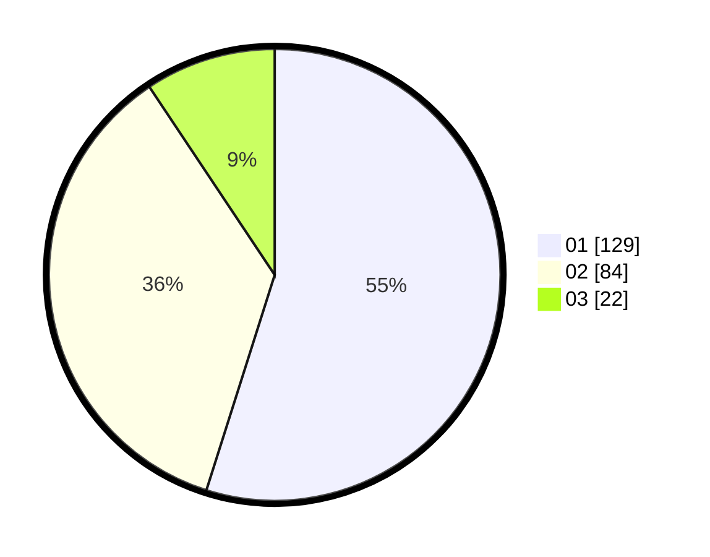

# Hasil

Hasil perolehan suara paslon dapat dilihat pada file paslon-01.txt, paslon-02.txt, dan paslon-03.txt.

Jika tidak ada, artinya data tersebut belum ada pada SIREKAP.

## Perolehan Suara

 * Paslon 01: **129**.
 * Paslon 02: **84**.
 * Paslon 03: **22**.

## Foto C Plano

https://sirekap-obj-formc.kpu.go.id/1949/pemilu/ppwp/31/74/09/10/02/3174091002113-20240216-123352--0c151260-9d66-49a7-80eb-edd71ce69292.jpg

https://sirekap-obj-formc.kpu.go.id/1949/pemilu/ppwp/31/74/09/10/02/3174091002113-20240216-123400--d3406514-8428-41ab-acef-61129a09b02c.jpg

https://sirekap-obj-formc.kpu.go.id/1949/pemilu/ppwp/31/74/09/10/02/3174091002113-20240216-123356--6359b5ca-a479-4aab-9aca-f40d15e581e6.jpg

## DATA PEMILIH TETAP

Jumlah pemilih dalam DPT: **281**.
 * L: **135**.
 * P: **146**.

## DATA PENGGUNA HAK PILIH

Jumlah pengguna hak pilih dalam DPT: **234**.
 * L: **107**.
 * P: **127**.

Jumlah pengguna hak pilih dalam DPTb: **0**.
 * L: **0**.
 * P: **0**.

Jumlah pengguna hak pilih dalam DPK: **0**.
 * L: **0**.
 * P: **0**.

Jumlah pengguna hak pilih: **235**.
 * L: **107**.
 * P: **128**.

## JUMLAH SUARA SAH DAN TIDAK SAH

JUMLAH SELURUH SUARA SAH: **235**.

JUMLAH SUARA TIDAK SAH: **0**.

JUMLAH SELURUH SUARA SAH DAN SUARA TIDAK SAH: **235**.
